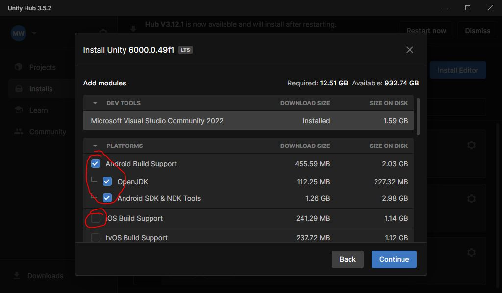

# Setting Up Unity

Now that git is set up, let's get your Unity working.

## Install Unity

1. Head over to Unity: [https://unity3d.com/get-unity/download](https://unity3d.com/get-unity/download).
2. Choose Unity Hub

3. Run Unity Hub and install our version of Unity Editor
* 6000.0.49f1
    * By the time class starts, 6000.0.49f1 may no longer be listed. In that case, choose the 6000.0 LTS option that IS available.

4. Make sure to select one or both of the mobile options

5. To support iOS devices, we need a Mac. Android can be supported from either PC or Mac.
* If you don't have an Android device, I'll try to have some loaner devices in the classroom.
* Also install Visual Studio 2022 as indicated.
 
{: .warn }
What if I want to use a different editor (VSCode, Rider, etc)?\
I will no longer support other editors in this class.\
It is frustrating to watch students struggle with simple operations simply because they refuse to change editors.

{: .note }
If you already have Unity installed, and you just need to add the mobile platform, click the gear symbol
next to the correct install and choose Add modules.

Then add the same platform options mentioned above.
