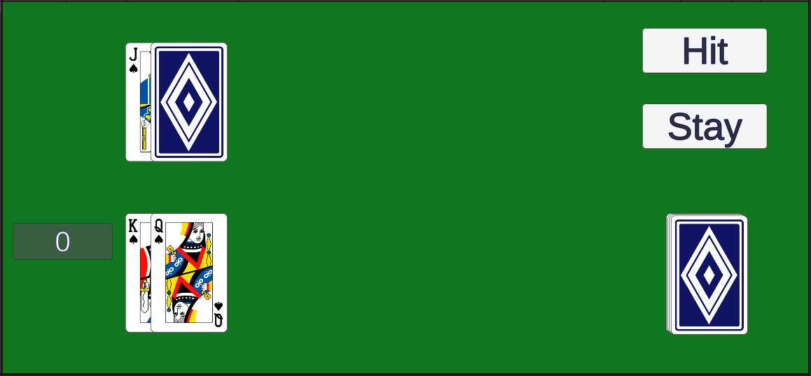
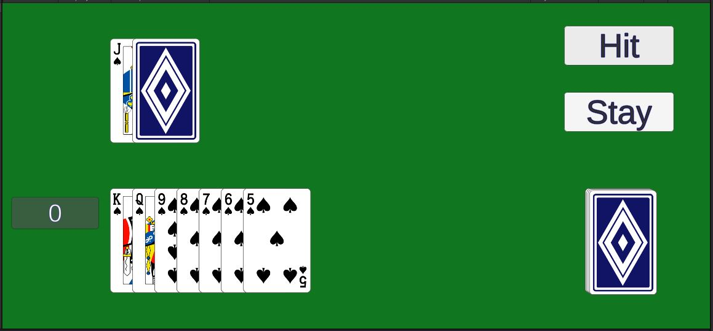

# Deck.GetCard()

In the class **Deck**, fill out the function `GetCard()`.
```
    public Card GetCard()
    {
        Card card = null;
        // TODO take the next card if there is one
        
        if (m_cards.Count <= 0)
        {   // if we're out of cards, gray out the deck image
            Image image = GetComponent<Image>();
            image.color = new Color(0.1f, 0.1f, 0.1f, 0.5f);
        }
        return card;
    }
```

{: .todo}
* If there are no **Card**s left in the `m_card` List, `card` should return `null`.
* Otherwise, remove one `card` from the List `m_card`.
* Use `SetActive` to activate that `card`'s **GameObject**.
* Return that.

{: .test}
Try it out. Hit Play In Editor.\


{: .note}
The order of the cards may vary depending on how you implemented the function.\
We'll do shuffling later.

# Game.PlayerHit()

In the class **Game**, fill in the function `PlayerHit()`.
```
    public void PlayerHit()
    {
        // TODO call GetCard() to get the next card from the deck and add it to the player's hand
        // call UpdatePlayerScore() to recalculate the player's score
        // if the player busts (score > 21), call PlayerStay()
    }
```

{: .todo}
* Call `GetCard` on the **Deck** to get a **Card**.
* Add that **Card** to the player's **Hand**.
* Call `UpdatePlayerScore` to calculate the player's new score.
* If the player busts (score exceeds 21), call `PlayerStay` to end the player's turn.

{: .test}
Try it out. Hit Play In Editor.\
The hit button should add cards to the player's hand.\


{: .note}
We still haven't shuffled the deck.\
The score doesn't work yet.