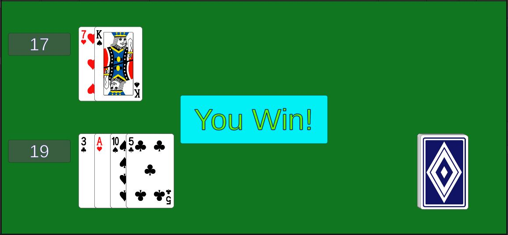

# Deck.Shuffle()

In the class **Deck**, fill out the function `Shuffle()`.
```
    void Shuffle()
    {
        // TODO shuffle the deck
    }
```
The simple way to shuffle a `List<>` in C# works like this:

{: .todo}
* Start off **n** as the number of cards in the deck
* Choose a random card index from 0 to **n**.
* Swap that card with the card at the end of the list
* Reduce **n** by 1 so that last card isn't part of the shuffle anymore
* Repeat until **n** hits 0 meaning every card has been shuffled

{: .test}


{: .note}
This is the end of the basic requirements.\
Push your code now before we move on to the next part.