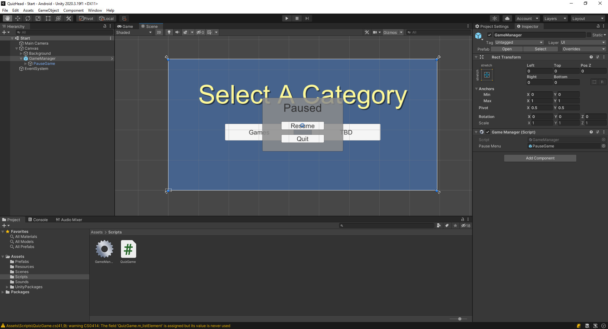
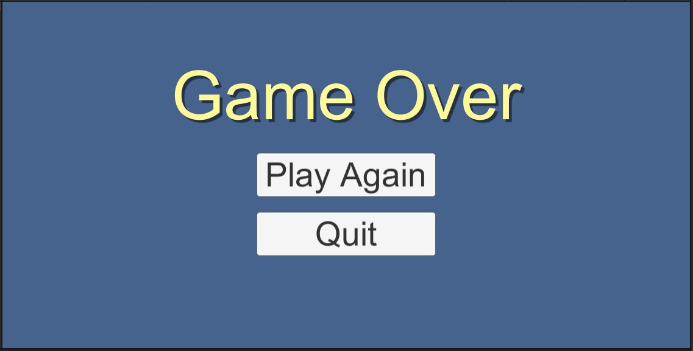

# Accept the Assignment
[Accept the Assignment](https://classroom.github.com/a/bIitYjSZ)

# Clone the Repo

This is the starting point for the project.\
We will start off with an existing project.

{: .test}
Open your starting project in Unity.\
There are 3 scenes in the project.\
Open the Start scene.\
It should look like this...

{: .test}
If you hit Play In Editor, you get a selection menu...
\
Hitting either option takes you straight to Game Over...

