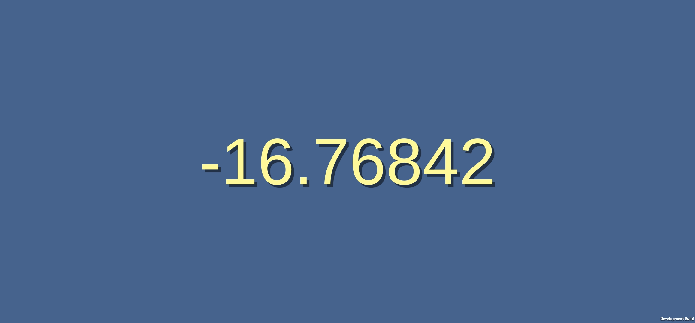
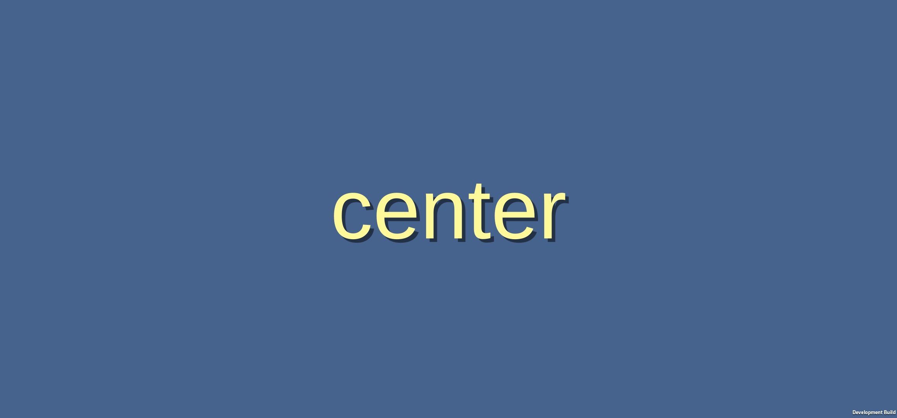

# QuizGame.ReadAngle()
In the class **QuizGame**, look for the **TODO** in the `ReadAngle()` function.
```
    float ReadAngle()
    {
        float ang = 0.0f;
        {   // TODO read the accelerometer, and turn that into an angle
        }
        return ang;
    }
```

{: .todo}
* Read the direction of the gravity vector with `Input.acceleration`
    * Watch out for that vector coming back as `(0, 0, 0)`
    * That could happen if there is no accelerometer (like it's on a PC)
* We'll be holding the phone sideways and tilting it face-down, so we're looking for gravity to point down the Z axis when tilted
* Use the gravity vector to calculate an angle with `Mathf.Asin()`
    * `Mathf.Asin()` returns radians, so use `Mathf.Rad2Deg` to convert it to degrees

# QuizGame.Update()
We would like to test our `ReadAngle()` function, but we haven't set up the game yet.\
To test it, add a new function
```
void Update()
{
    // TODO your code here
}
```

{: .todo}
* Add function `Update()`
* In that function, call `ReadAngle()` and set `m_text.text` equal to the result.
* You can use `.ToString()` on a float to convert from the float to a string.

{: .test}
The game should now display the angle of the phone.\

It should show 0 degrees when held facing out (as if it's on your head).\
It should show positive when facing down and negative when facing up.

{: .note}
If you try it on a PC, you have no accelerometer, so you'll just get 0 degrees.\
You won't be able to test out your `ReadAngle()` function without a phone.

# QuizGame.ReadInput()
Now let's fill in the **TODO** in the `ReadInput()` function
```
    QuizInput ReadInput()
    {
        QuizInput quizInput = new QuizInput();
        {   // TODO use ReadAngle and input.GetKey() to fill in quizInput
        }
        return quizInput;
    }
```

{: .todo}
* If the angle is greater than `m_tiltAng`, that means the phone is facing down
    * set `quizInput.down` to true
    * if not, make sure  `quizInput.down` is false
* If the angle is less than `-m_tiltAng`, that means the phone is facing up
    * set `quizInput.up` to true
    * if not, make sure  `quizInput.up` is false
* If the angle is between `-m_resetAng` and `m_resetAng`, that means the phone is centered
    * set `quizInput.center` to true
    * if not, make sure  `quizInput.center` is false

{: .note}
You will notice that there's a gap between `m_tiltAng` and `m_resetAng`.\
We call this "hysteresis".\
This helps prevent the phone from bouncing in and out of the up/down/center states due to tiny vibrations.

Debugging everything on the phone can be a little tedious.\
Let's set up a way to provide input when running on the PC.

{: .todo}
* If the user presses the up arrow key `Input.GetKey(KeyCode.UpArrow)`, set `quizInput.up` to true
    * be sure `quizInput.center` is false
* If the user presses the down arrow key `Input.GetKey(KeyCode.DownArrow)`, set `quizInput.down` to true
    * be sure `quizInput.center` is false
* If neither is pressed, set `quizInput.center` to true
    * make sure the keyboard behavior does not override the accelerometer behavior when centering

# QuizGame.Update()
Let's test out our input function.
{: .todo}
* Take out your `ReadAngle()` test in the `Update()` function.
* Replace it with a call to `ReadInput()`.
* You'll need to get a little creative to display the 3 states `up`, `down`, and `center` at the same time.
* Keep in mind that we're testing out the code... if there's a bug, it may be possible for the variables to be incorrectly set to up, down, and center at the same time.

{: .test}
Try it out.\

Make a few iterations until you get it all working right.

# Remove QuizGame.Update()
Now that we're done with the testing, don't forget to disable your `Update()` function.\
It might be smart to keep it around commented out in case you need to debug it later.\
But for now, make sure it doesn't interfere with the rest of the game.