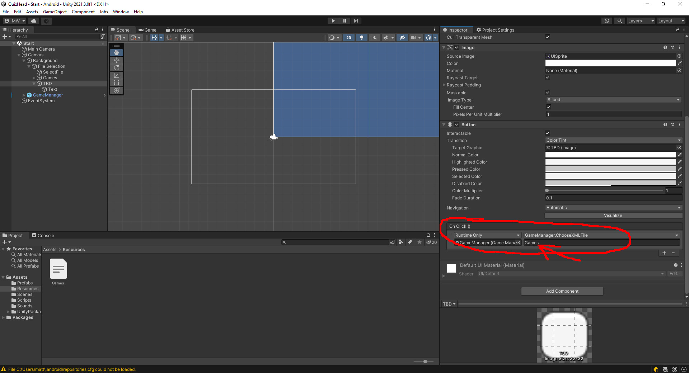
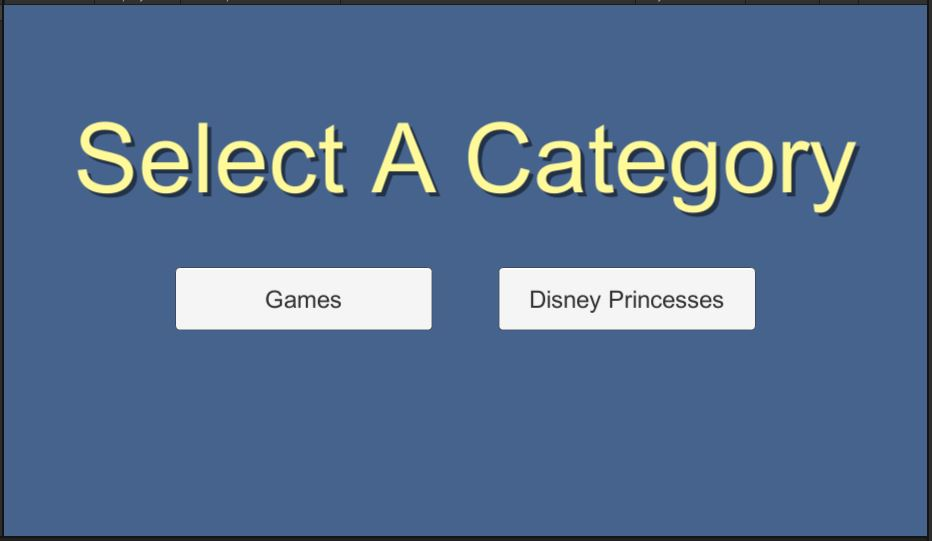

# Make a List
In the Resources folder, we will find 1 xml file: Games.xml.

{: .todo}
* Make a copy of that file and name it something else.
* Fill it with whatever elements you want, but make them thematically consistent.
    * Animals, Song Titles, Famous Inventors, Whatever
    * Include at least 3, but no more than 10 **QuizElement** in your **QuizList**.
    * (We want a reasonable number for rapid testing purposes. A longer list would be appropriate in a final commercial product.)

# Update the TBD button
In the Start scene, find the TBD button.

{: .todo}
* Rename the TBD button to match your new **QuizList**
* Change the Text element to match the name of your new list
* Change the "On Click" argument (circled in red) to the name of your new xml file
    * Do not include the .xml
    * For example, we load "Games.xml" by simply loading "Games".

{: .test}

\

{: .note}
This is the end of the basic requirements.\
Push your code now before we move on to the next part.

