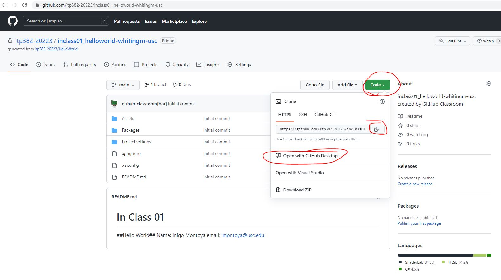
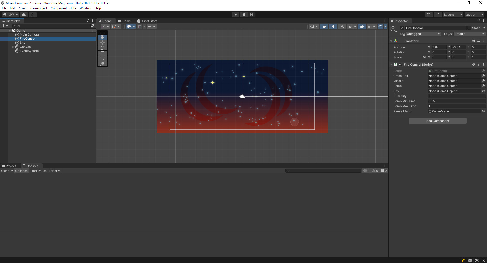
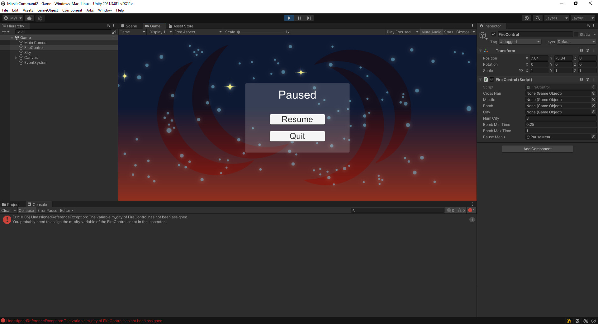

# Accept the Assignment
[Accept the Assignment](https://classroom.github.com/a/hOnS59ej)

# Clone the Repo

This is the starting point for the project.\
We will start off with an existing project.

{: .test}
Open your starting project in Unity.\
There is 1 scene in the project.\
Open the Game scene.\
It should look like this...

{: .test}
If you hit Play In Editor, an error will come up, and the game will say it's paused.

