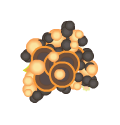
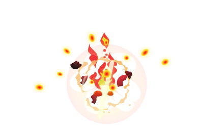
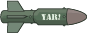
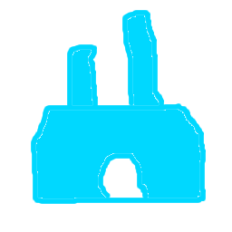
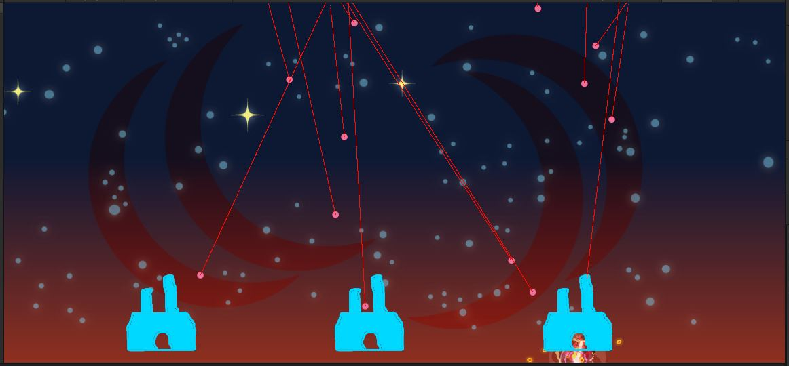

# Bomb
In the "Prefabs" folder, you will find "Bomb.prefab".\
If you look at it, you'll see it has a few components on it including a `SpriteRenderer` with this image on it:\
\
You might also notice it has a `LineRenderer`, a `Bomb` script, and a `CircleCollider2D`.

{: .note}
We will be talking about Colliders and Collision Detection next week.\
For this week, I have set it up for you.\
I don't have plans to specifically cover `LineRenderer` in class, but they are often useful.\
I suggest you use this as an example to refer to when you need to learn about them.

{: .todo}
* In the Game Scene, find the `GameObject` named "FireControl"
* That object has a `FireControl` script on it
* Drag your "Bomb" *prefab* into the "Bomb" slot of `FireControl`
	* If you look in the code, you'll see that is the variable `m_bomb`
	* Unity automatically converts "m_bomb" into "Bomb" for a more designer-friendly display
* Save the Scene

# Targeting Crosshair
In the "Sprites" folder, you will find Missile_Crosshairs.png.\

{: .todo}
* Drag that into the scene to create a `GameObject` with a `SpriteRenderer` on it
* Drag that new `GameObject` into the "Prefabs" folder to create a *prefab*

{: .note}
For more information about *prefabs*, check out this supplementary video: [Prefabs](https://youtu.be/bOIAkIdOc6o)

{: .todo}
* Delete the `GameObject` "Missile_Crosshairs" from your scene
	* We don't want a crosshair in the scene to start off. This will be created as needed when the user touches the screen.
* Your "FireControl" object has a slot on it for "Cross Hair". Drag your new prefab into this slot
	* If you look in the code, you'll see that is the variable `m_crossHair`
	* Unity automatically converts "m_crossHair" into "Cross Hair" for display
* Save your scene

{: .warn}
It's not a bad idea to commit (and maybe even push) your project.\
We haven't done much, but it's wise to commit small changes at a time.\
You will need to add your new *prefab* and the *meta* file that goes with it.

# Explosions
## Create a new prefab for the missile explosion

{: .todo}
* Drag the Sprite "Sprites\Explosion\Sprites\Explotion0008.png" into the scene to create a `GameObject` with a `SpriteRenderer` on it

* Rename the `GameObject` "Explosion"
* Add the script `MissileExplosion` to it
* Drag your new `GameObject` "Explosion" into the "Prefabs" folder to create a *prefab*
* Delete the `GameObject` from your scene

## Create a new prefab for the bomb explosion

{: .todo}
* Make a *prefab* called "BombExplosion" using Sprite "Sprites\BombExplosion\Sprites\Explotion0009.png"

	* Open the "Bomb" `prefab`
	* The `Bomb` class has a field on it called `m_explosion`. Fill that in with your "BombExplosion" *prefab*

## Create a new prefab for the city explosion

{: .todo}
* Make a *prefab* called "CityExplosion" using Sprite "Sprites\CityExplosion\Flame0009.png"

# Missile
Create a new prefab for the Sprite "Sprites\Missile_small\Missile.png".\

{: .todo}
* Drag that into the scene to create a `GameObject` with a `SpriteRenderer` on it
* Add the script `Missile` to it
* The `Missile` script has a field `m_explosion`. Fill that in with your *prefab* "Explosion"
* Drag your new `GameObject` "Missile" into the "Prefabs" folder to create a *prefab*
* Delete the `GameObject` from your scene
* Your "FireControl" object has a slot on it for "Missile". Drag your new prefab into this slot
* Save your scene

# City

{: .warn}
Programmer art detected

{: .todo}
* Drag Sprite "Sprites/City/CityA.png" into the scene to create a `GameObject` with a `SpriteRenderer` on it
* Name it "City"
* Add the script `City` to it
* `City` has a slot `m_explosion` on it. Put *prefab* "CityExplosion" in there
* Drag that new "City" `GameObject` into the "Prefabs" folder to create a *prefab*
* Delete the `GameObject` from your scene
* Your "FireControl" object has a slot on it for "City". Drag your new prefab into this slot
* Save your scene

{: .test}
Play in Editor.\
The bombs come down leaving their trails behind.\
When they hit the cities, the "CityExplosion" sprite appears.\

We don't have any input control yet, so there's nothing you can do about it.

{: .warn}
It's definitely time to commit and push.

