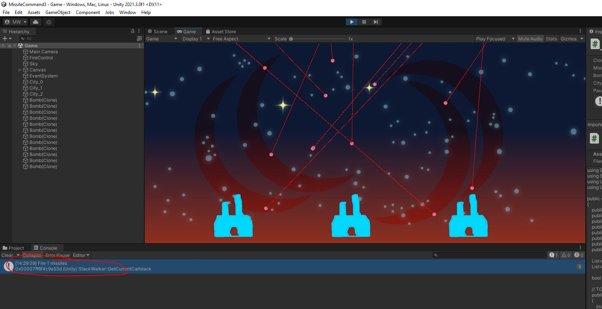
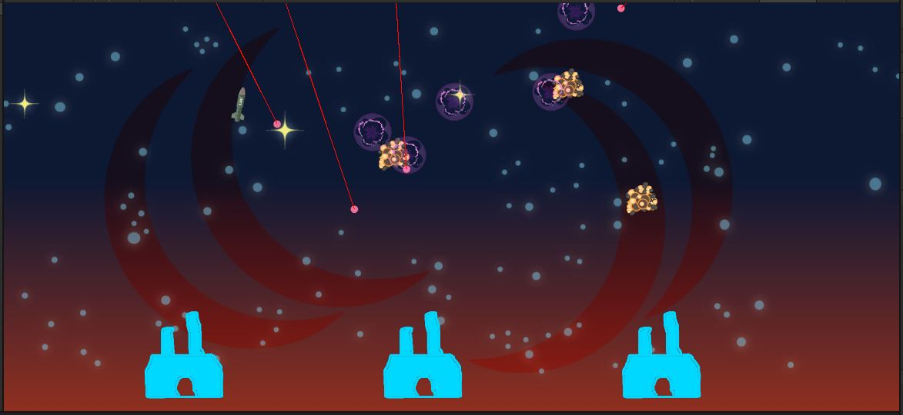

# MissileInput
Open up the "FireControl.cs" Script.\
Like we've done before, let's come up with a new class to describe the player's input in terms of gameplay - rather than in terms of the physical input.

{: .todo}
* Inside your **FireControl** class, create a new public class called **MissileInput**.
    * We are creating a class inside another class. This is a good way to organize
* The "inputs" for our game will be:
	* The location (a `Vector3`) of where the player is aiming
	* The location (a `Vector3`) of where the player fires a missile
* Inside your **MissilInput** class:
    * Both the "inputs" are one for each finger, so you'll want 2 `List<>`s
    * You'll want to initialize these to empty `List<>`s to start off

# ReadInput

{: .todo}
* Create a new function `MissileInput ReadInput()`. A function that returns a `MissileInput`.
* Create a new instance of a **MissileInput** as a local variable inside the function

{: .note}
Working with touch-based inputs requires the phone.\
Let's start by emulating our inputs via the mouse first.

{: .todo}
* If either `Input.GetMouseButtonDown(0)` or `Input.GetMouseButton(0)` returns `true`, add an element to your `List<>` for player aiming
	* Get the screen coordinates of the mouse with `Input.mousePosition`
	* I've provided a function `Utility.ScreenToWorldPos()` to convert that into world coordinates
	* It is this world position that you should record in your **MissileInput**.
* If `Input.GetMouseButtonUp(0)` returns `true`, that means the player has released the mouse button, so we should fire a missile
	* Get the screen coordinates of the mouse with `Input.mousePosition`
	* Use the same function `Utility.ScreenToWorldPos()` to convert that into world coordinates
* Return your **MissileInput**

# Update
Head up to the `Update()` function
```
    void Update()
    {
        if (false == m_isPaused)
        {
            // TODO Read the input

            // TODO Fire Missiles

            // TODO Make enough target reticles
            // Delete any extra target reticles

            // TODO Update the position of all the target reticles
        }

        // keys
        if (Input.GetKeyDown(KeyCode.Escape))
        {   // this doubles as the option key in the android navigation bar
            SetPause(!m_isPaused);
        }
    }
```

{: .todo}
* Call your new `ReadInput()` function
* For our first attempt, just use a `Debug.Log` to log out whenever the user fires a missile.

{: .test}
Play in Editor\
Whenever you release the mouse button, you should see your log message.\


# Fire Missiles
Back in `Update()`, let's fire some missiles.

{: .todo}
* For every fire command in your **MissileInput**
    * Call `FireMissile()`
    * Pass in the world position of the fire input

{: .test}
Play in Editor\
You should be able to fire the missiles now.\
Missiles fly to your target position and explode there.\
The explosions should destroy incoming bombs.\
At this point, the explosion sprites stay an screen forever.


# Aiming Reticles
The **FireControl** class has a member called `m_targets`.\
This is the list of all the current aiming reticles.\
For now, it's just an empty list.\
Head back to the `Update()` function.

{: .todo}
* Make sure the list `m_targets` has the same number of entries as your **MissileInput** has aiming positions
    * Create new targets like this: `GameObject cross = Instantiate(m_crossHair);`
    * Add the new targets to `m_targets`
    * If there are any extra items in `m_targets`, `Destroy()` them and remove them from `m_targets`
* Update the location of each of the `m_targets` to match the position in your **MissileInput** class

{: .note}
At this point, there is only 1 mouse, so there is a maximum of 1 aiming reticle.\
The plan is to extend this to handle multi-touch. That's why we have a list of these.\
It would be wise to set it up now to easily handle multiple targets once we add them.

{: .test}
Play in Editor\
You should be able to drag a single aiming reticle around with your mouse.\
The aiming reticle should vanish when you release the mouse button to fire a missile.

{: .warn}
I suggest a commit and push if you haven't recently.

# Touch Input
Now that mouse emulation works, let's enable the touch-screen.\
Head down to `ReadInput()`.

{: .todo}
* Read in all the touch inputs like so `Touch[] touches = Input.touches;`
* Go through the array of `touches` and separate them into aiming or firing commands based on the `phase` of the **Touch**
    * `TouchPhase.Ended` is for finger release (fire command)
    * `Began`, `Moved`, and `Stationary` are for aiming commands
    * The screen coordinates of the touch can be found in the `position` member of **Touch**
    * Don't forget to convert that to world coordinates with `Utility.ScreenToWorldPos()`

{: .test}
To test it out, we need to deploy it to the phone.\
Plug in your phone.\
Build and deploy to your phone.\
Check that a single finger successfully aims and fires a missile.\
Check that multiple fingers control multiple aiming reticles.\
Check that all aiming reticles vanish and missiles fire when you release your fingers from the screen.

{: .warn}
It's definitely time to commit and push.