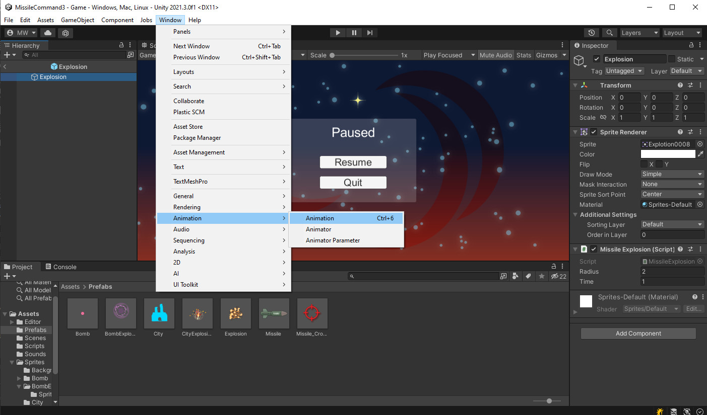
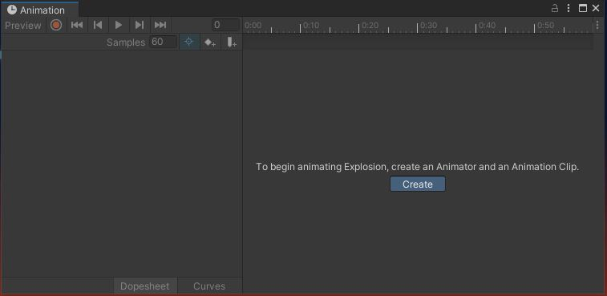
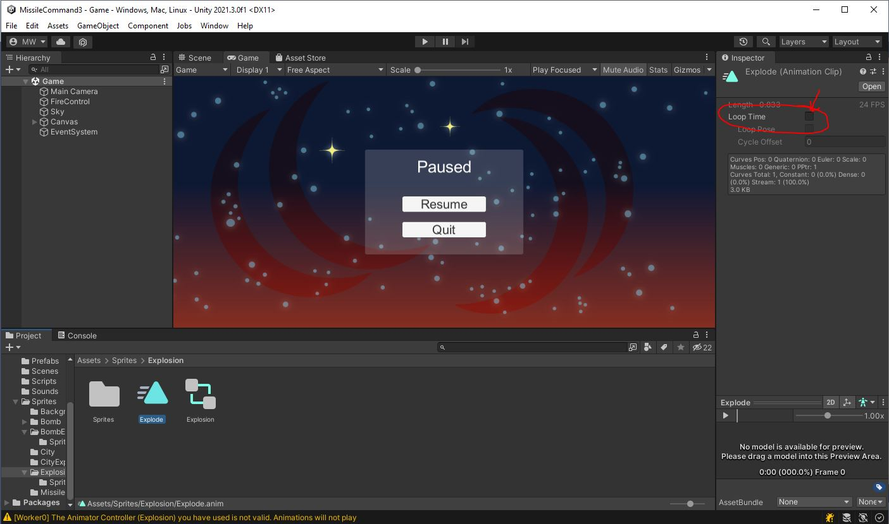

# Explosion
Open the *prefab* you made called "Explosion".\
This should be the one that happens when the player's missiles explode.

{: .todo}
* Select the `GameObject` of the *prefab*
* Open the Animation Window

* It will offer to create an Animation for you

* Save your animation as "Sprites/Explosion/Explode.anim"
* Select all the Sprites in "Sprites/Explosion/Sprites"
* Drag them into the Animation window
* Set the sample rate "Samples" to 24

* Select the animation you just created "Sprites/Explosion/Explode.anim"
* Uncheck the box for "Loop Time"


{: .test}
Try it out.\
The missile explosions should be animating now.

# SimpleAnim
The animation should work, but if you look closely at the Scene hierarchy, you may notice the explosions do not ever get deleted.

{: .todo}
* Open the "Explosion" *prefab* once more.
* Add the Script "SimpleAnim.cs" to it.
```
public class SimpleAnim : MonoBehaviour
{
    public bool m_randomRotate = true;
    public float m_minSpeed = 0.8f;
    public float m_maxSpeed = 1.2f;
    public float m_minScale = 0.8f;
    public float m_maxScale = 1.2f;
    public float m_minVolume = 0.8f;
    public float m_maxVolume = 1.2f;
    public float m_minPitch = 0.8f;
    public float m_maxPitch = 1.2f;

    Animator m_anim;
    AudioSource m_audio;

    // Start is called before the first frame update
    void Start()
    {
        m_anim = GetComponent<Animator>();
        m_audio = GetComponent<AudioSource>();
        if (null != m_anim)
        {
            m_anim.speed = Random.Range(m_minSpeed, m_maxSpeed);
        }
        transform.localScale = Random.Range(m_minScale, m_maxScale) * Vector3.one;
        if (m_randomRotate)
        {
            transform.localEulerAngles = new Vector3(0.0f, 0.0f, Random.Range(0.0f, 360.0f));
        }
        if (null != m_audio)
        {
            m_audio.volume = Random.Range(m_minVolume, m_maxVolume);
            m_audio.pitch = Random.Range(m_minPitch, m_maxPitch);
        }
        StartCoroutine(DeleteWhenDone());
    }

    IEnumerator DeleteWhenDone()
    {
        if (null != m_anim)
        {
            var state = m_anim.GetCurrentAnimatorStateInfo(0);
            yield return new WaitForSeconds(state.length * state.speed);
        }
        if (null != m_audio)
        {
            while (m_audio.isPlaying)
                yield return null;
        }
        Destroy(gameObject);
    }
}
```
**SimpleAnim** performs a handful of useful functions.\
`m_randomRotate` causes the animation to be randomly rotated to any angle each time one is created.\
`m_minSpeed` and `m_maxSpeed` randomize the speed the animation plays back.\
`m_minScale` and `m_maxScale` randomize the size of the animation.\
And when we get around to doing sounds, there are some randomizers set up for that too.\
All of these features help to create some variety so the effects don't look too repetitive.\
The other thing **SimpleAnim** does for us is `Destroy()` the object when the animation is finished.

# Bomb Explosion
Open the *prefab* called "BombExplosion".

{: .todo}
* Add an animation "Sprites/BombExplosion/Explode.anim"
* Add all the Sprites in "Sprites/BombExplosion/Sprites"
* Set the sample rate to 24
* Don't forget to uncheck the "Loop Time" field
* Add a **SimpleAnim**

# City Explosion
Open the *prefab* called "CityExplosion".

{: .todo}
* Add an animation "Sprites/CityExplosion/Explode.anim"
* Add all the Sprites in "Sprites/CityExplosion"
* Set the sample rate to 24
* Don't forget to uncheck the "Loop Time" field
* Add a **SimpleAnim**

# Bomb
Open the *prefab* called "Bomb".

{: .todo}
* Add an animation "Sprites/Bomb/Bomb.anim"
* Add all the Sprites in "Sprites/Bomb/Sprites"
* Set the sample rate to 24
* Leave this one as a looping animation
    * Don't put a **SimpleAnim** on this one

{: .test}
Try it out.\
All the explosions should animate now.\
Double-check to make sure the explosions delete themselves when they are done.

{: .warn}
Don't forget to commit and push.


