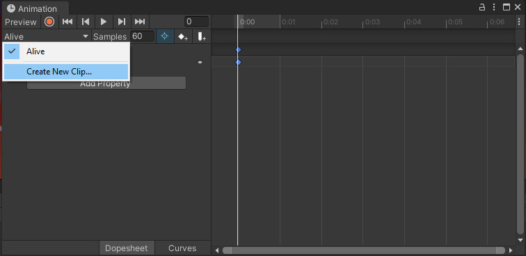
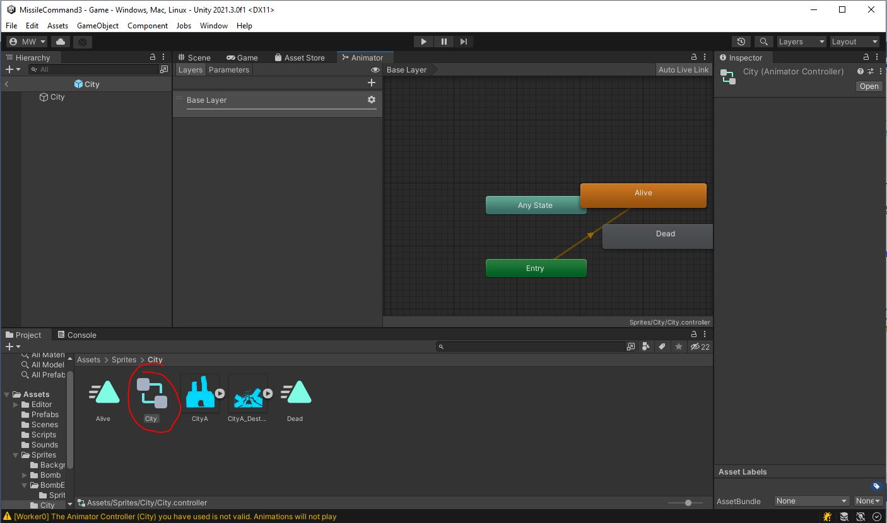
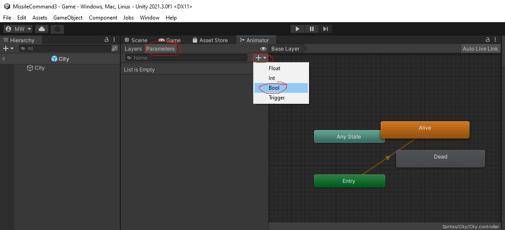
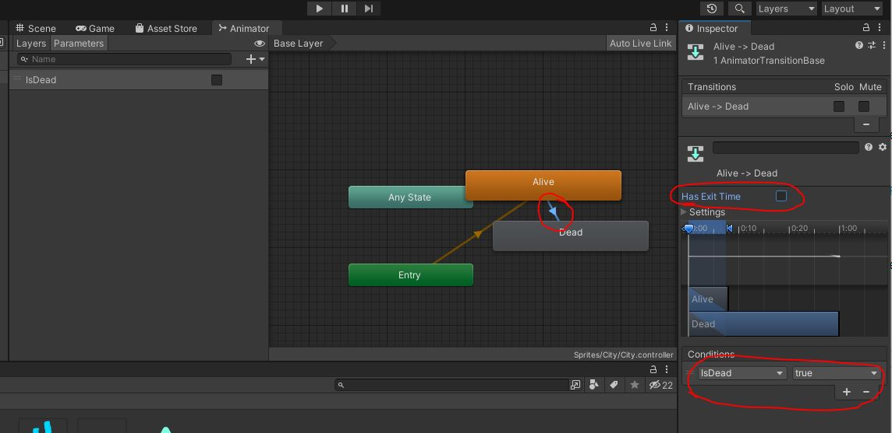
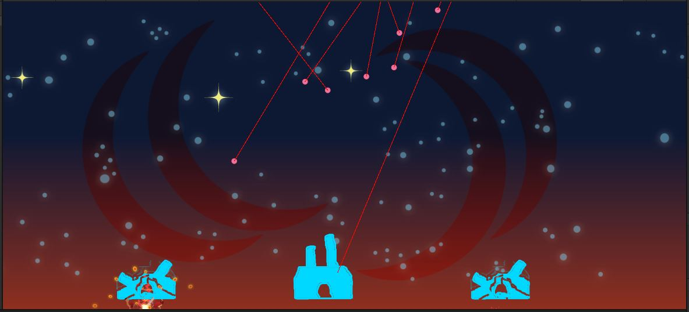

So far, all of our animations are simple fire-and-forget.\
Let's set one up that transitions from one animation to another.

# City
Open the "City" prefab.

{: .todo}
* Create an animation for it called "Sprites/City/Alive.anim"
* Attach just the single sprite "Sprites/City/CityA.png"
* On the Animation window, select the drop-down with "Alive" on it and "Create New Clip"

* Save the new clip as "Sprites/City/Dead.anim"
* Attach just the single sprite "Sprites/City/CityA_Destroyed.png"
* You can close the Animation window now
* Open the Animator Controller for the City

You'll see that it already has your 2 animation states: "Alive" and "Dead".\
We need a way to tell it when to switch from one to the other.
* Create a new Parameter of type Bool

* Name it "IsDead"
* Create a transtion from the "Alive" state to the "Dead" state
* Select the transition and
	* Uncheck "Has Exit Time"
	* Add Condition "IsDead" "true"

* Create a transition from the "Dead" state back to the "Alive" state
* Select the transition and
	* Uncheck "Has Exit Time"
	* Add Condition "IsDead" "false"

{: .note}
In the **City** class, you'll find functions `Explode()` and `Restore()`.\
Take a look at these to see how the "IsDead" parameter you created is being controlled.\
This is how the animation transitions are set up.

{: .test}
Play in Editor.\
Check that the cities switch to the destroyed image when hit.\
Check that the cities reset to the alive image when the game resets.\
The game is now fully funtional.\

<iframe style="display:block; margin: 0 auto;" src="https://drive.google.com/file/d/1q3i_C4UCxcAZhTMdoyetH04sbOQJWacV/preview" width="852" height="480" allow="autoplay"></iframe>

{: .warn}
Don't forget to commit and push.

