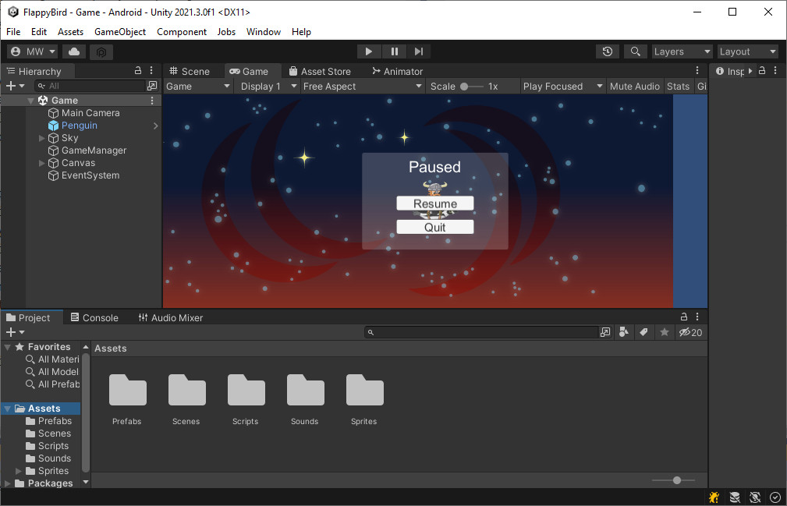

# Accept the Assignment
[Accept the Assignment](https://classroom.github.com/a/4WhBD1tq)

# Clone the Repo
This is the starting point for the project.\
We will start off with an existing project.

{: .test}
Open your starting project in Unity.\
There is 1 scene in the project.\
Open the Game scene.\
It should look like this...

{: .test}
If you hit Play In Editor, the penguin will sink to the bottom.\
Press the space bar to flap his wings and control his vertical position.

