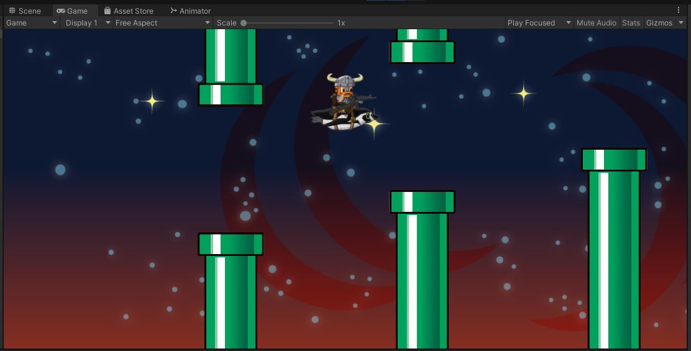

# Pipe Prefabs
"Assets/Prefabs/pipe.prefab" is a prefab for the pipe object.\
If you open that up, you'll see that it consists of 2 different prefabs:\
"Assets/Prefabs/pipe_bottom.prefab" and "Assets/Prefabs/pipe_top.prefab".\
The "GameManager" object in the Scene has a **GameManager** script on it,
and that script has a `m_pipe` public variable on it.
* Point that variable to the "pipe.prefab"
    * Drag the prefab into that slot and save the scene

# GameManager.Start()
```
    void Start()
    {
        m_lastCamPos = Camera.main.transform.position;
        m_lastPos = m_lastCamPos;
        m_lastCamPos.x -= m_horizSpacing;   // spawn the first pipe now
        m_lastPos.x += m_firstPipeAt;       // the first pipe is this far forward from the starting position

        // grab the player for future reference
        m_player = FindObjectOfType<PlayerBird>();

        SetPause(false);
    }
```
The `GameManager.Start()` function is already set up to help you with the next steps.\
We will be tracking the camera as it moves forward (following the player).\
We will spawn in a new pipe section each time the camera moves forward by a specific amount (`m_horizSpacing`)\
By subtracting `m_horizSpacing` from the initial camera position, we'll ensure that on the first call to `Update()`,
the camera will already be far enough forward to trigger the first pipe.\
The position of that first pipe is set up with `m_firstPipeAt`.

# GameManager.Update()
Check out the **TODO** in `GameManager.Update()`
```
    void Update()
    {
        {   // TODO make pipes
        }

        if (null == m_player)
        {   // Player Died
            StartCoroutine(GameOver());
        }

        // keys
        if (Input.GetKeyDown(KeyCode.Escape))
        {   // this doubles as the option key in the android navigation bar
            SetPause(!m_isPaused);
        }
    }
```

{: .todo}
* You can get the current world-position of the camera with `Camera.main.transform.position`
* Check to see whether the camera has traveled far enough yet to warrant the creation of the next pipe obstacle
    * Use the variable `m_lastCamPos` to keep track of the last time you created a pipe
    * Use the variable `m_horizSpacing` to determine how often you need to create a new pipe
    * Use the variable `m_lastPos` to keep track of where the last pipe was created
        * So you can figure out where the next one belongs
* Create a new copy of the `m_pipe` prefab with the `Instantiate()` function
* Use `m_vertSpacing` together with `Random.Range()` to randomly offset the vertical position of each new pipe.

{: .test}
The pipes should appear now\


{: .warn}
Don't forget to commit and push.


