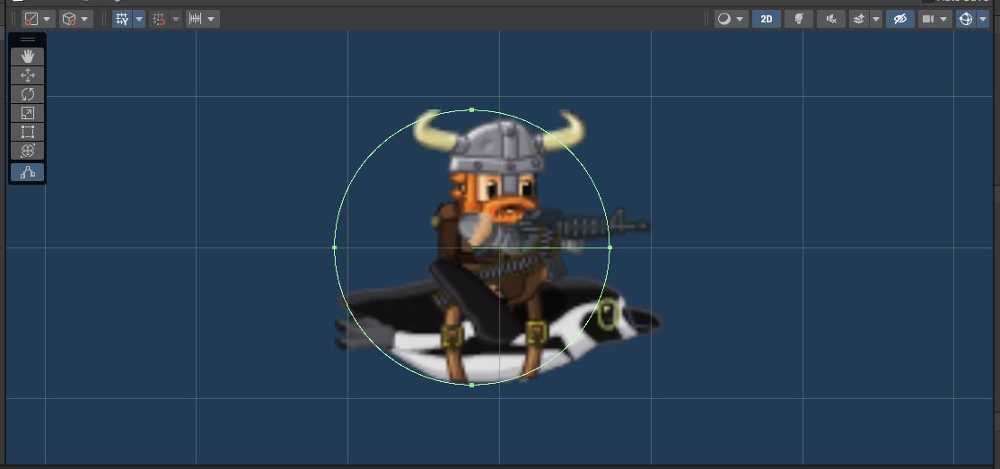
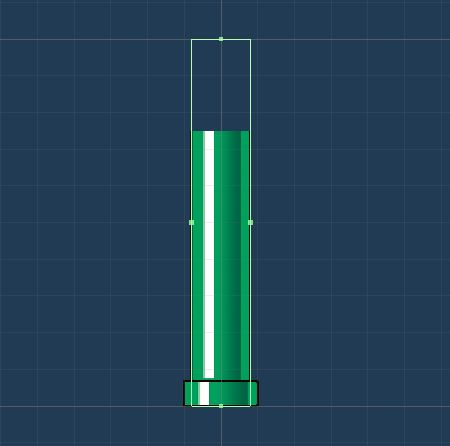

# Player

{: .todo}
* Open up "Assets/Prefabs/Penguin.prefab"
* Add a **CircleCollider2D**
    * Make it a trigger
* Adjust the size of the collider to mostly cover the player
    * Be a little generous (make the collider slightly smaller than the player)... we don't want to have the player hit pipes unless they definitely hit one


{: .note}
You may notice that I've biased the collider a bit to the back of the player.\
Since the player is forced to move forward, the front is the area that we want to best match the graphics.

# Pipes

{: .todo}
* Open up "Assets/Prefabs/pipe_bottom.prefab"
* Add a **BoxCollider2D**
    * This one is NOT a trigger
* Adjust it to match the visuals
    * Feel free to extend it well below the bottom of the graphics
* Add a **RigidBody2D**
    * Set "Gravity Scale" to 0 so it doesn't fall off the bottom of the screen


{: .note}
You will notice that I've made the collider match the smaller section of the pipe, and there are little bits of the top that actually stick out.\
It's better to be a little generous to the player rather than have them crash when they should not.


{: .todo}
* Open up "Assets/Prefabs/pipe_top.prefab"
* Add a **BoxCollider2D**
    * This one is NOT a trigger
* Adjust it to match the visuals
* Add a **RigidBody2D**
    * Set "Gravity Scale" to 0 so it doesn't fall off the bottom of the screen


# Bird.cs
Head over to "Bird.cs" and find the **TODO** at the bottom of the class
```
    // TODO Create Collision Function
```

{: .todo}
* Add a function `void OnTriggerEnter2D(Collider2D collision)`
* When Unity detects a collision between a 2D Trigger Collider (like we put on the player) and a 2D Rigid Body Collider (Like we put on the pipes), it will automatically attempt to call this function (if it exists)
* If the player hits a pipe, that's game over, so simply call `Bird.Die()`
    * The player's death will be detected in the `GameManager.Update()` function
```
        if (null == m_player)
        {   // Player Died
            StartCoroutine(GameOver());
        }
```

{: .test}
Play In Editor.\
You now need to flap to make it through the gaps in the pipes.\
Make sure you check the collisions with both the top and bottom pipes.

{: .warn}
Did you remember to commit and push?


