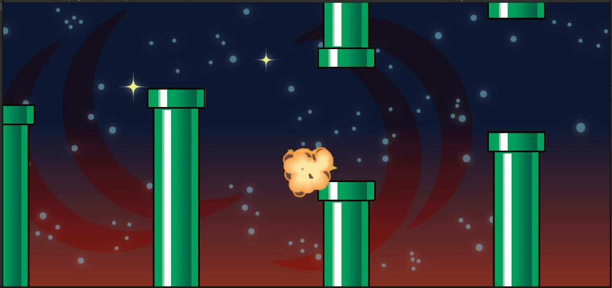

# Crash Sound

## Death Effect Prefab
When the player crashes, we spawn a little animation.\
To save us time, I've already set that up for you using the same techniques we had in the previous lab.

In "Bird.cs", take a look at the `Die()` function.
```
    public void Die()
    {
        if (null != m_deathEffect)
        {
            GameObject obj = Instantiate(m_deathEffect);
            obj.transform.position = transform.position;
        }
        Destroy(gameObject);
    }
```
That `m_deathEffect` is a prefab that contains this animation.\
All we need to do is add a sound to it.

{: .todo}
* Open the "Assets/Prefabs/Explosion.prefab"
* Drag "Assets/Sounds/BirdDeath.wav" onto that prefab

## Randomize the Sound
Let's get some random variation into the sound.\
Find the **TODO** in `SimpleAnim.Start()`
```
    void Start()
    {
        m_anim = GetComponent<Animator>();
        m_audio = GetComponent<AudioSource>();
        if (null != m_anim)
        {
            m_anim.speed = Random.Range(m_minSpeed, m_maxSpeed);
        }
        transform.localScale = Random.Range(m_minScale, m_maxScale) * Vector3.one;
        if (m_randomRotate)
        {
            transform.localEulerAngles = new Vector3(0.0f, 0.0f, Random.Range(0.0f, 360.0f));
        }
        {   // TODO randomize the volume and pitch of m_audio if there is one
        }
        StartCoroutine(DeleteWhenDone());
    }
```

{: .todo}
* If `m_audio` is null, just skip it
* Otherwise, use `Random.Range()` to set the `volume` between `m_minVolume` and `m_maxVolume`
* Randomize the `pitch` between `m_minPitch` and `m_maxPitch`

## DeleteWhenDone()
One of the main jobs of **SimpleAnim** is to delete the object when the animation is finished.\
What if the animation finshes, but the sound is still going?\
We need to wait until both the animation and the sound have finished.\
Find the **TODO** in `SimpleAnim.DeleteWhenDone()`
```
    IEnumerator DeleteWhenDone()
    {
        if (null != m_anim)
        {
            var state = m_anim.GetCurrentAnimatorStateInfo(0);
            yield return new WaitForSeconds(state.length * state.speed);
        }
        {   // TODO yield until the m_audio is finished playing
        }
        Destroy(gameObject);
    }
```

{: .todo}
* If `m_audio` is null, just skip it
* Otherwise, use `m_audio.isPlaying` to *yield* until the sound is finished
    * We're talking about a while loop here.

{: .test}
Now when you crash, you should hear the bird squawk sound.

# Flapping Sound

## Bird.cs
Let's add a flapping sound.

{: .todo}
* At the top of "Bird.cs", add a new public variable of type **AudioSource**
    * Call your variable `m_flapSound`
* In `Bird.Update()` find the **TODO**
```
    protected virtual void Update()
    {
        Vector3 pos = transform.position;
        if (m_flap)
        {
            m_ySpeed += m_flapBoost;
            {   //TODO play the flap sound
            }
        }
        ...
    }
```
* If the flap sound is not null, call `.Play()` on it

{: .note}
The sound is a variable of type **AudioSource**.\
We might say we are calling the function `AudioSource.Play()`.\
That is NOT a static function, so we wouldn't literally type "AudioSource.Play()". You would put `[your variable name].Play()`

## Player Prefab

{: .todo}
* Open "Assets/Prefabs/Penguin.prefab"
* Drag "Assets/Sounds/joustfla.wav" onto it to add an **AudioSource**
    * Uncheck the "Play On Awake" flag. We only want it to play when we flap
* Drag that **AudioSource** into the `m_flapSound` slot of the **PlayerBird** component

{: .test}
Try out the flap sound.\
It should play and repeat every time you flap your wings.

{: .warn}
If you don't commit and push, you might lose all your work if anything goes wrong.


