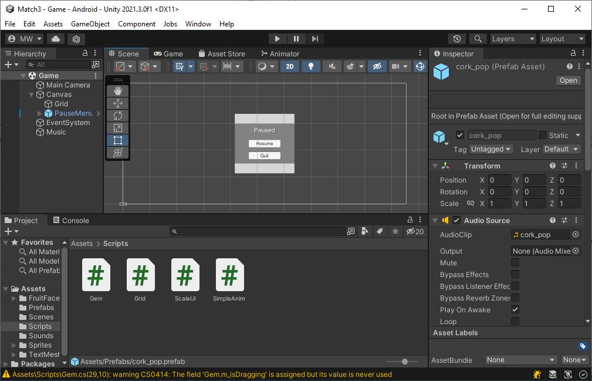
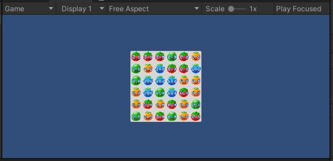

# Accept the Assignment
[Accept the Assignment](https://classroom.github.com/a/QUuHvaCy)

# Clone the Repo
This is the starting point for the project.\
We will start off with an existing project.

{: .test}
Open your starting project in Unity.\
There is 1 scene in the project.\
Open the Game scene.\
It should look like this...

# SimpleAnim.cs
* Copy your SimpleAnim.cs from Lab04 over to this lab.

{: .test}
If you hit Play In Editor, you'll see happy little fruit characters fall into place in the grid.\
A music track is set up, and it begins playing.

