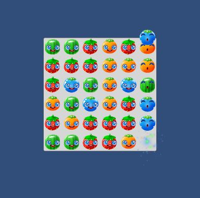

# GemGrid.CheckMatch()
Check out `GemGrid.CheckMatch()`
```
    bool CheckMatch()
    {
        // a list of gems to be broken
        List<Gem> breakGems = new List<Gem>();

        {   // TODO
            // check for matches of 3 or more gems in the vertical direction
            // check for matches of 3 or more gems in the horizontal direction
        }
        {   // TODO call BreakGem() on all the gems in your list of gems to break
            // If there are any, play the gem popping sound
            // If any gems broke, return true to indicate we need to re-enter the "falling" stage
        }

        return false;   // returning false indicates everything is static
    }
```

## Break Gems
Let's start at the bottom of the function where we break every gem in the list `breakGems`.

{: .todo}
* Go through the list `breakGems` and call `Gem.BreakGem()` on each of them
* If the list `breakGems` was not empty (something broke)
    * Play the gem popping sound by instantiating a copy of the prefab `m_gemPopSound`
    * Return true to indicate that the board needs to go back into "falling" mode again

## Test it out

{: .todo}
* Head up to the first **TODO** in the `CheckMatch()` function
* As a quick test, add one of the gems from `m_grid` to the list `breakGems`
    * I suggest something from the bottom row because it looks cooler

{: .test}
When you Play In Editor,\
one gem should pop,\
the sound should play,\
and the grid should fall to repeat the process over and over.


## Match Groups of Three

{: .todo}
* Remove your test code
* Loop over all the elements of `m_grid`
* Compare the `m_gemType` of adjacent **Gem**s
* If 3 or more gems in a row have the same `m_gemType`, add them to the `breakGems` list
* Look in the horizontal and vertical directions

{: .note}
Looping over the grid is going to involve a nested loop.\
Looking for matches is another loop nested inside those loops.

{: .test}
Play In Editor.\
Groups of 3 often form naturally.\
Start and stop the game a few times to make sure you see (and hear) some popping.\
Once the grid stops, check it over to make sure no groups of 3 have been left unpopped.\
Unpopped groups of 3 indicate a bug you need to fix.

{: .warn}
Let's commit and push before we move on to the next step.