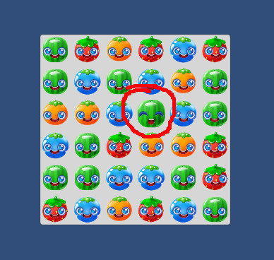

# Gem.cs
```
public class Gem : MonoBehaviour
    // TODO Add pointer down and pointer up handlers
    // TODO add drag handlers
```

## Click Reaction

{: .todo}
* Begin by inheriting from the pointer down and pointer up handlers
    * IPointerDownHandler
    * IPointerUpHandler
* Add function `public void OnPointerDown(PointerEventData eventData)`
    * Set the bool parameter called "Touched" on the Animator to true
* Add function `public void OnPointerUp(PointerEventData eventData)`
    * Set the bool parameter called "Touched" on the Animator to false

{: .test}
Play In Editor\
When you click a gem (fruit character), you should see it's face change.


## Drag

{: .todo}
* Make **Gem** inherit from
    * IBeginDragHandler
    * IEndDragHandler
    * IDragHandler
* Add function `public void OnBeginDrag(PointerEventData eventData)`
    * reset `m_dragDelta` to zero
* Add function `public void OnEndDrag(PointerEventData eventData)`
    * Set bool "Touched" on the animator to false
* Add function `public void OnDrag(PointerEventData eventData)`
    * Use `eventData.delta` to accumulate the total amount of drag in `m_dragDelta`
    * If `m_dragDelta` accumulates more than `s_swipeDist` in any single direction
        * Call m_grid.Swap()
        * Set bool "Touched" on the animator to false
        * Make sure you cannot continue dragging the same gem without releasing the touch and re-touching it

{: .note}
Hint: I've added a `m_isDragging` bool to the class.\
You might want to use that to keep track of when the drag is complete so that you do not double-swipe a gem.

{: .test}
Try it out.\
You should be able to swipe gems to make matches.\
Make sure you can drag left, right, up, and down.\
Make sure matches work. Be sure to check vertical and horizontal matches.\
Don't forget to check for groups of 3 and 4 at least.

{: .warn}
It's time to commit and push.


