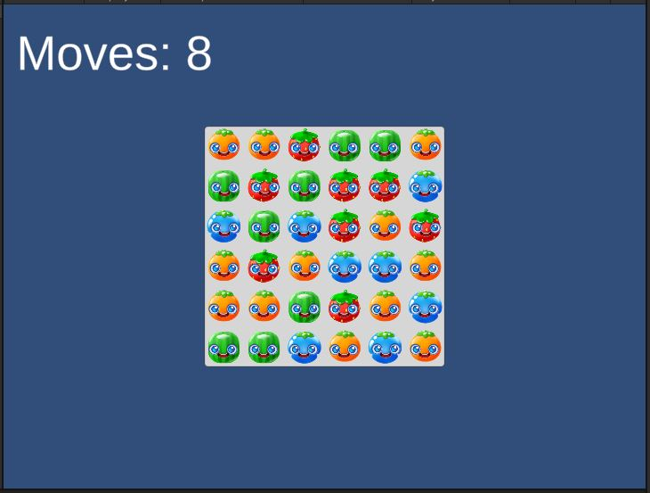
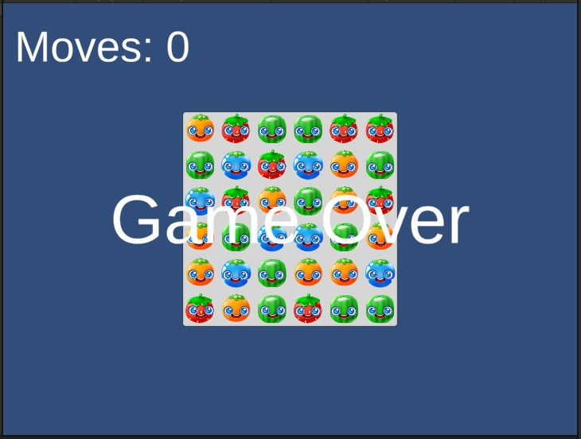

# Game Over

{: .todo}
* Create a UI Text element that says "Game Over"
* Hide the text element at start
* Find the **TODO** in `GemGrid.GameOver()`
```
    public void GameOver()
    {
        {   // TODO change this to kick-off a coroutine
            // Unhide the "Game Over" text
            // Delay 2 seconds
            // Then load the scene in the coroutine
            SceneManager.LoadScene("Game");
        }
    }
```
* Create a new *coroutine* and make `GameOver()` start the *coroutine*
	* Reveal the text
	* Start a timer delay of 2 seconds
	* Then reload the "Game" scene

# Moves


{: .todo}
* Add a UI element to display the number of moves the player has left
* Start it off at 10 moves
* Each time the player swipes a gem (fruit), subtract a move
* When we hit 0 moves, call `GameOver()`

{: .test}
You should now get only 10 moves before "Game Over" appears and the level resets


{: .warn}
I'd commit and push it now before we move on.


