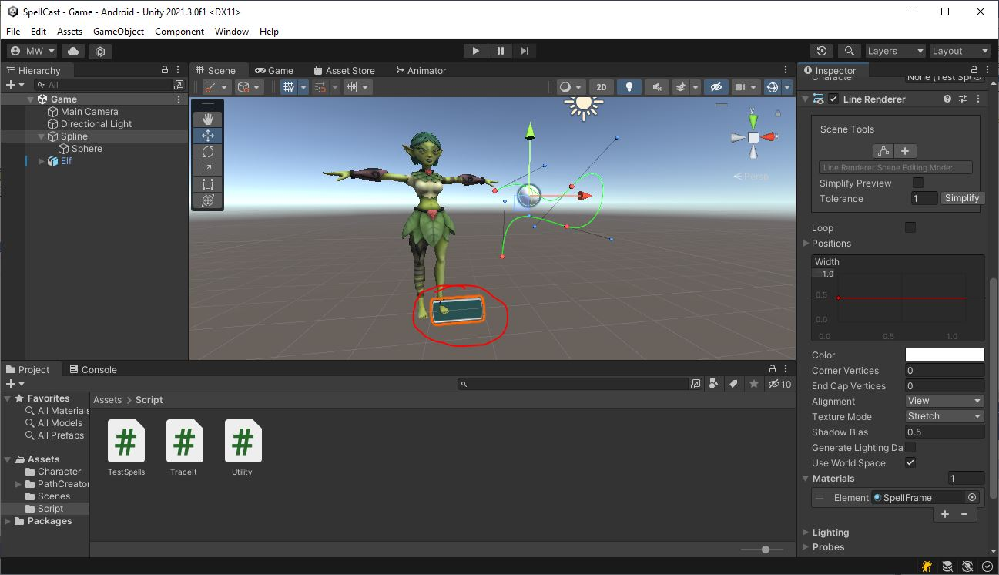
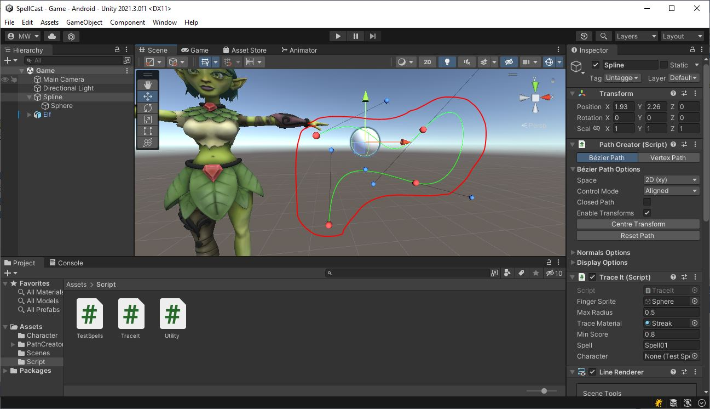

# Spline
The game is managed via the **GameObject** labeled "Spline".\
Let's take a look at what we've got on here.

## LineRenderer
Down at the bottom of the Inspector list, you'll see there is a **LineRenderer** on here.

At this point, it just looks like a little rectangle.\
At runtime, the **LineRenderer** will be updated to follow the curve of the **PathCreator** (see below)

## PathCreator
Unity doesn't come with any spline-based features built in.\
I'm not a big fan of using plugins, but in this case, we'll make an exception.\
[Bezier Path Creator](https://assetstore.unity.com/packages/tools/utilities/b-zier-path-creator-136082#content)
is free on the asset store, and it provides a very accessible tool for editing Bezier splines.\
I've used it to create a curved path for the finger trace.


## TraceIt
This is where the action is going to happen, but if you look at it now, you'll see it's almost entirely empty.
```
public class TraceIt : MonoBehaviour
{
    public GameObject m_fingerSprite;
    public float m_maxRadius = 0.5f;
    public Material m_traceMaterial;
    public float m_minScore = 0.8f;
    public string m_spell = "Spell01";
    public TestSpells m_character;

    PathCreator m_path;
    LineRenderer m_line;
    LineRenderer m_traceLine;

    enum Status
    {
        WAIT,
        TRACING
    }
    Status m_status;
    Keyframe[] m_traceFrames;

    // Start is called before the first frame update
    void Start()
    {
        {   // TODO get the PathCreator as "m_path"
            // Get the LineRenderer as "m_line"
        }

        {   // TODO change m_line to have the same number of points as m_path
            // Set the position of each of m_line's points to the matching point in m_path (use PathCreator.path.GetPath())
        }
        {   // TODO make a new object as a child of this one
            // add a LineRenderer component to it.
            // copy all the positions for the new LineRenderer from m_line only moved forward by 0.01f units (negative z)
        }
        {   // TODO create an array of Keyframe - one for each point (m_path.path.NumPoints)
            // Fill each one with time going from 0.0f to 1.0f and value 0.0f for all
            // Set m_traceLine.widthCurve to a new AnimationCurve based on m_traceFrames
        }

        m_status = Status.WAIT;
        m_fingerSprite.SetActive(false);
    }

    void Update()
    {
        {   // TODO on left mouse button down (which doubles as first finger touch)
            // enable the "m_fingerSprite"
            // set the "m_status" to Status.TRACING
            // reset all the "m_traceFrames" to 0.0f
        }
        {   // TODO on left mouse button up (first finger lift)
            // call Release()
        }
        {   // TODO if the left mouse button is held (doubles as finger on screen)
            // convert the mouse (finger) position from screen to world coords with Utility.ScreenToWorldPos()
            // use that to find out where on m_path the finger seems to be closest
            // place "m_fingerSprite" on the path at the point nearest the finger
            // if the finger is too far away from the path (more than "m_maxRadius"), call Release() to end the spell-cast
            // if the finger has reached the end of the path, call Release() to end the spell-cast
            // give the finger position a score from 0-1 based on the distance from the path. 1.0f for 0 distance and 0.0f for "m_maxRadius" away
            // put that position score into "m_traceFrames" at the appropriate spot
            // update "m_traceLine.widthCurve" with the latest "m_traceFrames" to draw the trace
        }
    }

    void Release()
    {
        {   // TODO if "m_status" was "Status.TRACING":
            // hide the "m_fingreSprite",
            // set "m_status" back to "Status.WAIT",
            // Calculate the player's score with Score(), and
            // if score is at least "m_minScore", call CastSpell() on the "m_character"
        }
    }

    float Score()
    {
        float score = 0.0f;
        {   // TODO go through all the per-point scores in "m_traceFrames"
            // Combine them to come up with an overall score in the range of 0.0f to 1.0f and return the score
        }
        return score;
    }
}
```
There are a bunch of **TODO**s in there. We'll get to those shortly.

## Sphere
"Spline" has a sub-object called "Sphere" that's just a sphere.\
We'll be using that to indicate where the player's finger is as they trace the spell.
