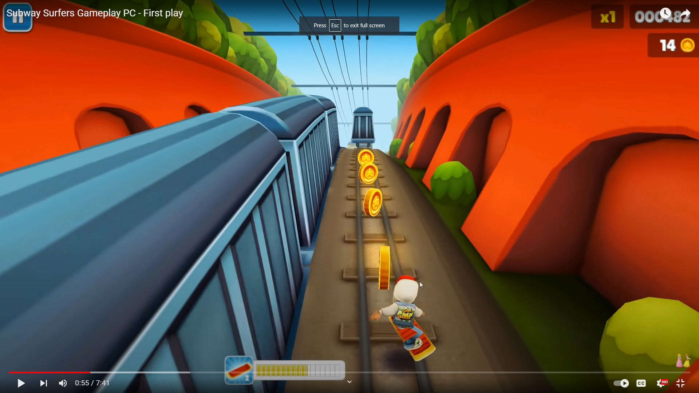
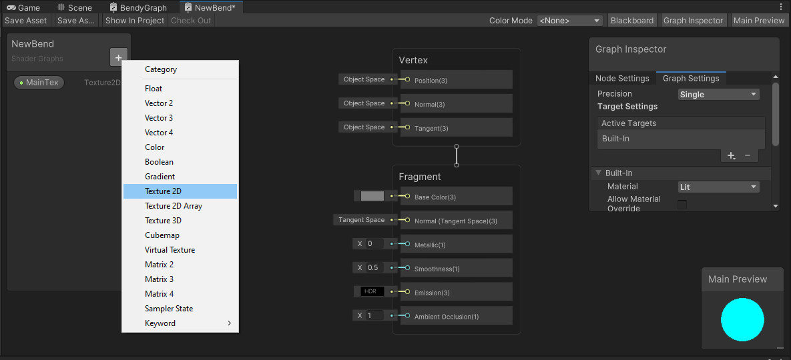
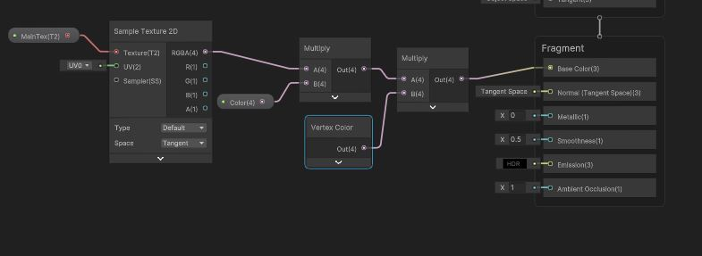
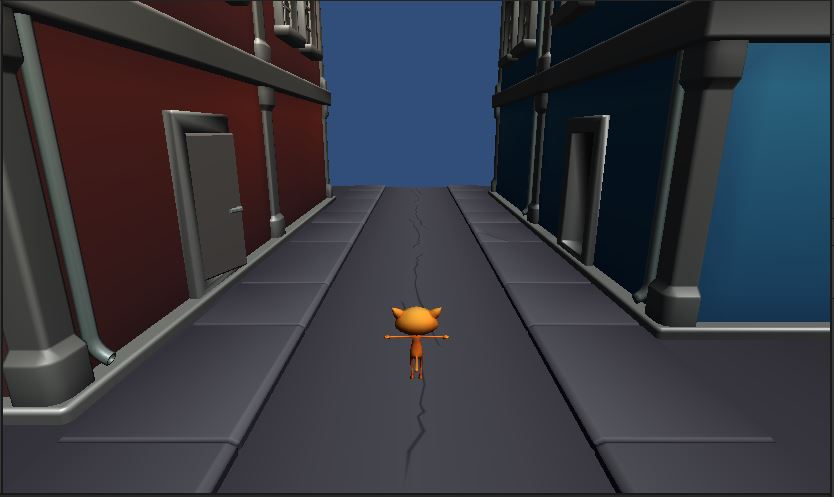

# Curved World
In Subway Surfers, the player is running along an infinite track, and the camera is looking forward.\
To solve the problem of the infinite draw distance, the track is curved. This creates an artificial horizon that the player cannot see past.
[](https://youtu.be/ZtHCnXMjIXY?t=55)

## Shaders
We could create a curved world like this by curving all the objects, carefully connecting them together, and moving them along a curved trajectory.\
That sounds like a lot of work.\
What we'll really do is program a *shader* to perform the curving for us during the render.

{: .note}
A *shader* is a program that runs on the graphics card.\
There are different types of *shader*, and we'll be using a "Vertex Shader" for this.\
A "Vertex Shader" is a little program that the graphics card will run for **every** vertex it draws.

# Shader Graph
We have 2 options for shaders in Unity.\
We can create a text file that contains the shader program.\
Or we can use a visual editor called "Shader Graph".

{: .note}
To be honest, the text version is just WAY simpler as you'll see.\
However, the graphical version is friendlier in a lot of ways.\
The "Shader Graph" approach is the preferred way for a lot of people, so that's the way we'll go.

## The Text Version
Here's what the text version looks like. We'll be translating this into "Shader Graph".
```
Shader "Custom/Bendy"
{
    Properties
    {
        _Color ("Color", Color) = (1,1,1,1)
        _MainTex ("Albedo (RGB)", 2D) = "white" {}
        _Glossiness ("Smoothness", Range(0,1)) = 0.5
        _Metallic ("Metallic", Range(0,1)) = 0.0
    }
    SubShader
    {
        Tags { "RenderType"="Opaque" }
        LOD 200

        CGPROGRAM
        // Physically based Standard lighting model, and enable shadows on all light types
        #pragma surface surf Standard fullforwardshadows vertex:vert wfiVertCol

        // Use shader model 3.0 target, to get nicer looking lighting
        #pragma target 3.0

        sampler2D _MainTex;

        struct Input
        {
            float2 uv_MainTex;
            float4 color : Color;
        };

        half _Glossiness;
        half _Metallic;
        fixed4 _Color;
        float _BendyX;
        float _BendyY;

        // Add instancing support for this shader. You need to check 'Enable Instancing' on materials that use the shader.
        // See https://docs.unity3d.com/Manual/GPUInstancing.html for more information about instancing.
        // #pragma instancing_options assumeuniformscaling
        UNITY_INSTANCING_BUFFER_START(Props)
            // put more per-instance properties here
        UNITY_INSTANCING_BUFFER_END(Props)

        void vert(inout appdata_full v)
        {
            float4 pos = mul(UNITY_MATRIX_MV, v.vertex);
            float zSq = 0.01 * pos.z * pos.z;
            pos.x += _BendyX * zSq;
            pos.y += _BendyY * zSq;
            v.vertex = mul(pos, UNITY_MATRIX_IT_MV);
        }

        void surf (Input IN, inout SurfaceOutputStandard o)
        {
            // Albedo comes from a texture tinted by color
            fixed4 c = tex2D(_MainTex, IN.uv_MainTex) * _Color * IN.color;
            o.Albedo = c.rgb;
            // Metallic and smoothness come from slider variables
            o.Metallic = _Metallic;
            o.Smoothness = _Glossiness;
            o.Alpha = c.a;
        }
        ENDCG
    }
    FallBack "Diffuse"
}
```

# Create a Shader Graph

{: .todo}
* Right-Click in your Assets somewhere and Create->Shader Graph->BuiltIn->Lit Shader Graph


## Fragment Shader
First let's imitate the look of the original shader by duplicating the coloring effects.\
We do this in the "Fragment Shader".

{: .todo}
* The original "Custom/Bendy" shader (shown above) had a texture called "MainTex"
    * Add a new Texture 2D as shown and name it "MainTex"

* Add a Color called "Color"
* We want to *sample* the "MainTex" and multiply that times "Color"
    * Right-click to "Create Node" and use the search tool to create a "Sample Texture 2D"

    * Drag your "MainTex" onto the graph
    * Connect the output of "MainTex" to the "Texture" input of your sample node
    * Drag your "Color" onto the graph
    * Right-click to "Create Node" and create a "Multiply" node
    * Drag the output of the Sampler (RGBA) to one input of the Multiply
    * Drag "Color" to the other input of the Multiply
* The original shader also supported "Vertex Color"
    * Right-click to "Create Node" a "Vertex Color"
    * Create another "Multiply" node.
    * Multiply the output of your previous Multiply node with the "Vertex Color"
        * This should amount to MainTex x Color x Vertex Color
    * Drag the output of the final Multiply to the input "Base Color"

* Save it

## Apply the Shader

{: .todo}
* Find the material on the Road prefabs
* Change that material to use your new shader

{: .test}
The road should still look right.
We don't have any bending yet.


## Apply the Shader Everywhere

{: .todo}
* Find all the prefabs
    * buildings
    * cars
    * bananas
* Change all their materials to use your new shader

{: .warn}
That's enough work, I'd want to commit and push.


