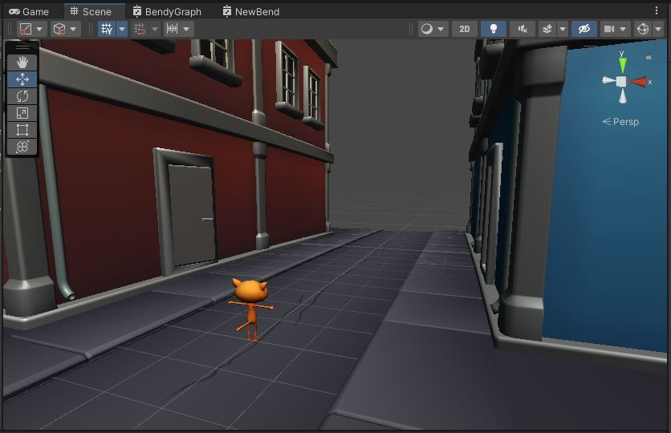
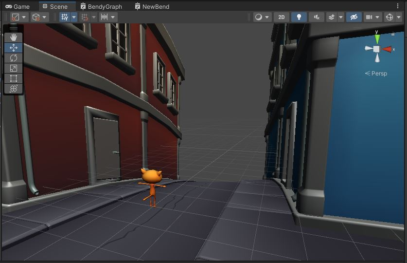

# Bendy Shader
Now let's hit the bendy part.\
To bend objects, we need to move their vertices.\
That means we must operate in the Vertex Shader.\
First, let's take a closer look at the text version.
```
        void vert(inout appdata_full v)
        {
            float4 pos = mul(UNITY_MATRIX_MV, v.vertex);
            float zSq = 0.01 * pos.z * pos.z;
            pos.x += _BendyX * zSq;
            pos.y += _BendyY * zSq;
            v.vertex = mul(pos, UNITY_MATRIX_IT_MV);
        }
```
The first line
```
float4 pos = mul(UNITY_MATRIX_MV, v.vertex);
```
That's a matrix multiply. A matrix called `UNITY_MATRIX_MV` is multiplied times the input vertex position `v.vertex`.\
The `UNITY_MATRIX_MV` matrix transforms from *Model Space* (also called *Object Space*) into *View Space*.\
In *View Space*, the forward direction is Z. This means `pos.z` is the distance from the camera.\
The second line
```
float zSq = 0.01 * pos.z * pos.z;
```
squares the distance and multiplies that by a constant `0.01`.
The next 2 lines
```
pos.x += _BendyX * zSq;
pos.y += _BendyY * zSq;
```
Bends the position in the X and Y direction based on how far from the camera the vertex is.\
The last line
```
v.vertex = mul(pos, UNITY_MATRIX_IT_MV);
```
puts the position back into *Model Space* (aka *Object Space*).

{: .note}
This is not actually a *Vertex Shader*.\
Unity gives us this *surface shader* which is really a piece inserted in the front of their standard *Vertex Shader*.

# Shader Graph
Let's translate that in the Shader Graph.

## Z-Squared

{: .todo}
* Shader Graph makes the *View Space* position available
    * Add a "Position" node and select "View" space
* Use a "Split" node to extract the Z coordinate (Labeled "B")
* Use a "Multiply" node to square the *View Space* z
* And one more "Multiply" node to multiply by 0.01


## BendyX and BendyY
The next thing in the text version is to multiply by BendyX and BendyY.

{: .todo}
* Create 2 float parameters called "_BendyX" and "_BendyY"
* Mark these 2 parameters as **not** Exposed


{: .note}
"_BendyX" and "_BendyY" are *global* parameters.\
That means these are not set separately for each material, but are shared by all materials that use this shader.\
"Exposed" parameters are set on a per-material basis.\
Not-"Exposed" parameters are set globally.

{: .todo}
* Drag "_BendyX" and "_Bendy" into your graph
* Use "Multiply" and "Add" nodes to perform this math
```
pos.x += _BendyX * zSq;
pos.y += _BendyY * zSq;
```
* Remember that `pos` is the *view-space* position

## Transform back to Model/Object Space

{: .todo}
* Use a "Transform" node to transform the resulting `pos` from *View Space* into *Object Space* (aka *Model Space*)
* Feed that into "Position" input on the "Vertex"


{: .test}
In the scene view, you should see that everything seems to work, but the curve is too slight to really see.

Change that 0.01 constant in your shader to 0.1, and you'll see a dramatic effect.


{: .warn}
Put the 0.01 constant back.\
Then commit and push before we go on

