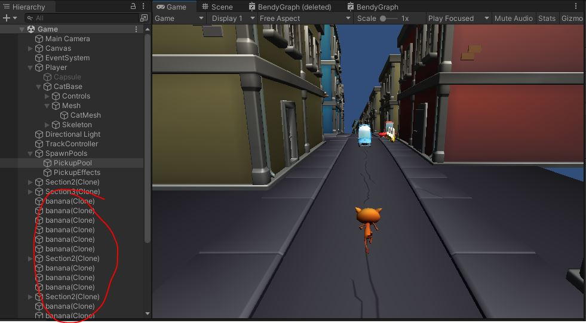
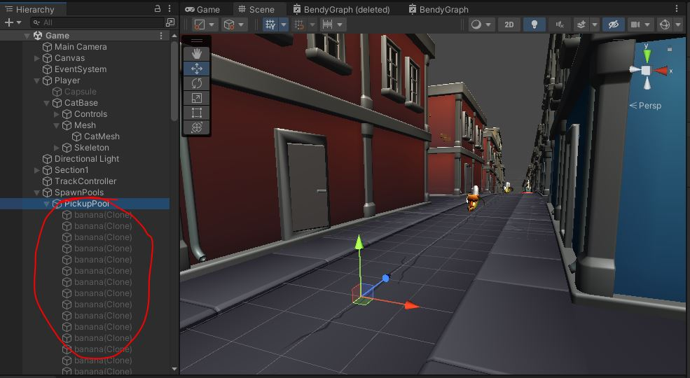

{: .note}
Before we put our objects into pools, let's check out what the game does without them.\
Play in editor and check out the bananas.

That's a lot of bananas. Let's recycle those.

# ObjectPools
Check out "ObjectPool.cs"
```
public class ObjectPool : MonoBehaviour
{
    public GameObject m_prefab;
    public int m_numObj = 100;
    
    List<GameObject> m_pool;

    protected virtual void Awake()
    {
        {   // TODO create the "m_pool"
            // fill it with "m_numObj" copies of "m_prefab"
            // make them children of this GameObject
            // deactivate them all by calling SetActive(false)
        }
    }

    public GameObject Allocate(Vector3 pos)
    {
        {   // TODO go through the "m_pool" and find the first inactive one
            // set its parent to null, its position to "pos" and activate it
            // call PooledObject.Init() on it.
            // and return the object
            // If there are no inactive elements in "m_pool", just return null
        }
        return null;    // none left available
    }

    public void Free(GameObject obj)
    {
        {   // TODO Call PooledObject.Stop() on the object
            // re-parent the object as a child of this
            // and deactivate the object with SetActive(false)
        }
    }
}
```

## Awake
Head to the first **TODO** in the `Awake()` function.

{: .todo}
* Create the `m_pool`
* Fill it with `m_numObj` copies of `m_prefab`
* Make them children of this **GameObject**
* Deactivate them all by calling `SetActive(false)`

## Allocate
Head to the second **TODO** in the `Allocate()` function.

{: .todo}
* Go through the `m_pool` and find the first inactive one
* Set its parent to null, its position to `pos` and activate it
* Call `PooledObject.Init()` on it
* and return the object
* If there are no inactive elements in `m_pool`, just return `null`

## Free
The final **TODO** in this file is in `Free()`

{: .todo}
* Call `PooledObject.Stop()` on the object
* Re-parent the object as a child of this one
* Deactivate the object with `SetActive(false)`

{: .test}
We aren't caling `Allocate()` or `Free()` yet, but we can test the `Awake()`.\
Check out the pool of deactivated bananas waiting to be used under the "SpawnPools/PickupPool"


{: .warn}
Do I have to say it?


