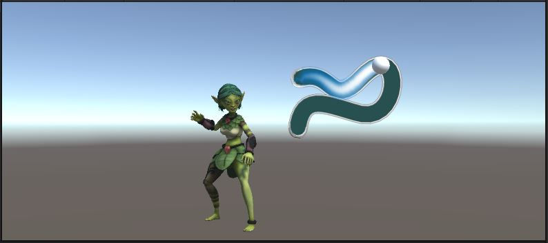
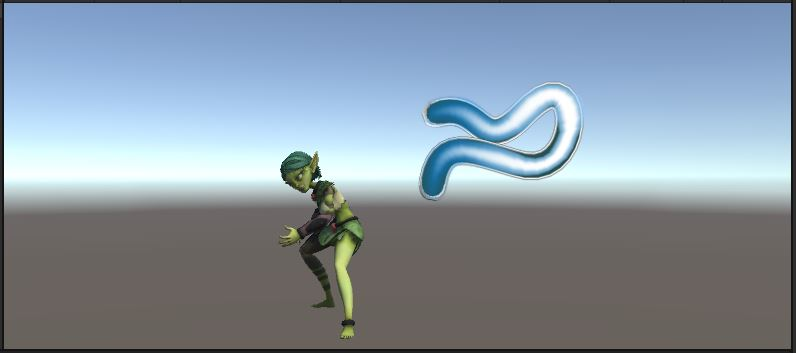

# Update
Head down to the `TraceIt.Update()` function
```
    void Update()
    {
        {   // TODO on left mouse button down (which doubles as first finger touch)
            // enable the "m_fingerSprite"
            // set the "m_status" to Status.TRACING
            // reset all the "m_traceFrames" to 0.0f
        }
        {   // TODO on left mouse button up (first finger lift)
            // call Release()
        }
        {   // TODO if the left mouse button is held (doubles as finger on screen)
            // convert the mouse (finger) position from screen to world coords with Utility.ScreenToWorldPos()
            // use that to find out where on m_path the finger seems to be closest
            // place "m_fingerSprite" on the path at the point nearest the finger
            // if the finger is too far away from the path (more than "m_maxRadius"), call Release() to end the spell-cast
            // if the finger has reached the end of the path, call Release() to end the spell-cast
            // give the finger position a score from 0-1 based on the distance from the path. 1.0f for 0 distance and 0.0f for "m_maxRadius" away
            // put that position score into "m_traceFrames" at the appropriate spot
            // update "m_traceLine.widthCurve" with the latest "m_traceFrames" to draw the trace
        }
    }
```

## Finger Touch Starts
In the first **TODO**

{: .todo}
* On left mouse button down (which doubles as first finger touch)
    * Enable the `m_fingerSprite` **GameObject**
    * Set the `m_status" to `Status.TRACING`
    * Reset all the `m_traceFrames` values to 0.0f

## Finger Lift
In the second **TODO**

{: .todo}
* On left mouse button up (first finger lift)
    * Call `Release()` (We'll get to that in a minute)

## Finger Touch Held
In the third **TODO**

{: .todo}
* If the left mouse button is held (doubles as finger on screen)
    * Convert the mouse (finger) position from screen to world coords with `Utility.ScreenToWorldPos()`
    * Use that to find out where on `m_path` the finger seems to be closest
        * Place `m_fingerSprite` on the path at the point nearest the finger
        * If the finger is too far away from the path (more than `m_maxRadius`), call `Release()` to end the spell-cast
        * If the finger has reached the end of the path, call `Release()` to end the spell-cast
        * Give the finger position a score from 0-1 based on the distance from the path
            * 1.0f for 0 distance and 0.0f for `m_maxRadius` away
        * Put that position score into `m_traceFrames` at the appropriate spot
    * Update `m_traceLine.widthCurve` with the latest `m_traceFrames` to draw the trace

## Release()
```
    void Release()
    {
        {   // TODO if "m_status" was "Status.TRACING":
            // hide the "m_fingreSprite",
            // set "m_status" back to "Status.WAIT",
            // Calculate the player's score with Score(), and
            // if score is at least "m_minScore", call CastSpell() on the "m_character"
        }
    }
```

{: .todo}
* If `m_status` was `Status.TRACING`:
        * Hide the `m_fingreSprite`
        * Set `m_status` back to `Status.WAIT`
        * Calculate the player's score with `Score()` (we'll get to that in a bit)
        * If score is at least `m_minScore`, call `CastSpell()` on the `m_character`

{: .test}
You should be able to use the mouse to trace over the curve and see the trace as you go.

Since we haven't set up `Score()` yet, no spell animation will happen yet.

# Score
```
    float Score()
    {
        float score = 0.0f;
        {   // TODO go through all the per-point scores in "m_traceFrames"
            // Combine them to come up with an overall score in the range of 0.0f to 1.0f and return the score
        }
        return score;
    }
```

{: .todo}
* Go through all the per-point scores in `m_traceFrames`
* Combine them to come up with an overall score in the range of 0.0f to 1.0f and return the score

{: .test}
If you trace the path well enough, you should see the spell animation.
You can also see the areas in the path where you traced accurately and the places you were a little off.


{: .warn}
Be sure to commit and push before we move on to the "choose your path" part.
