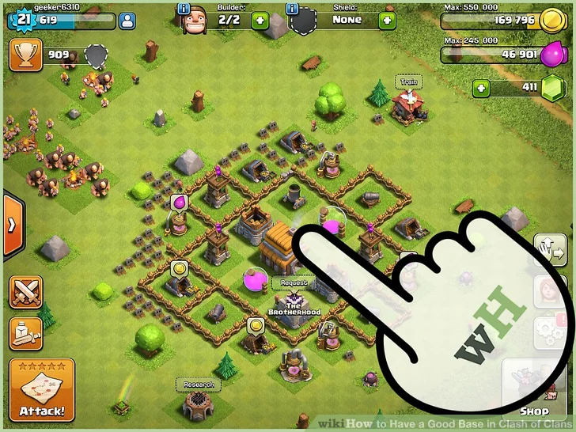

# Lab 08: ClashOfClans1

[Clash of Clans](https://supercell.com/en/games/clashofclans/) is an online mobile strategy game.\
We are going to split the game up and look at 2 different aspects over 2 separate labs.\
In this first lab, we'll examine the way a player builds their town.\
Here's the [Android Version](https://play.google.com/store/apps/details?id=com.supercell.clashofclans&referrer=mat_click_id%3Df6890da7bad79ed3290aa334b12d358d-20141216-1681)\
And the [iOS Version](https://apps.apple.com/app/clash-of-clans/id529479190)

Our version of the lab should end up looking like this:
<iframe style="display:block; margin: 0 auto;" src="https://drive.google.com/file/d/1Q_FNkZP4k1cZgkMfPOhmDXPZErxtmD4r/preview" width="854" height="480" allow="autoplay"></iframe>

