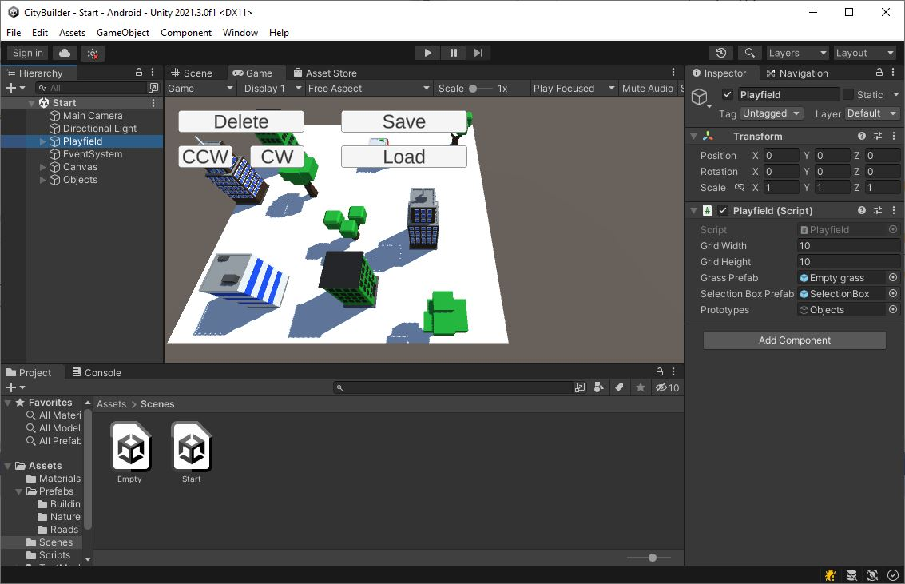
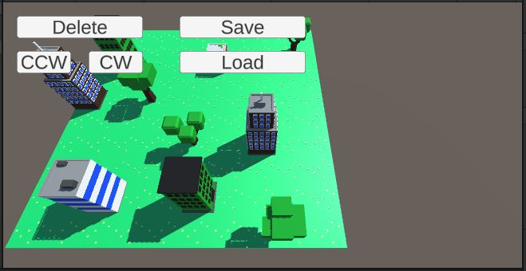

# Accept the Assignment
[Accept the Assignment](https://classroom.github.com/a/IoNUxqr8)

# Clone the Repo
This is the starting point for the project.\
We will start off with an existing project.

{: .test}
Open your starting project in Unity.\
There are 2 scenes in there "Assets/Scenes/Empty.unity" and "Assets/Scenes/Start.unity".\
We'll be starting in the "Start" scene, so open that to begin with.

{: .test}
When you hit play, the grass field fills in.\
There are some UI buttons in the top-left corner, but they don't do anything yet.\
Nothing else is functional yet.

