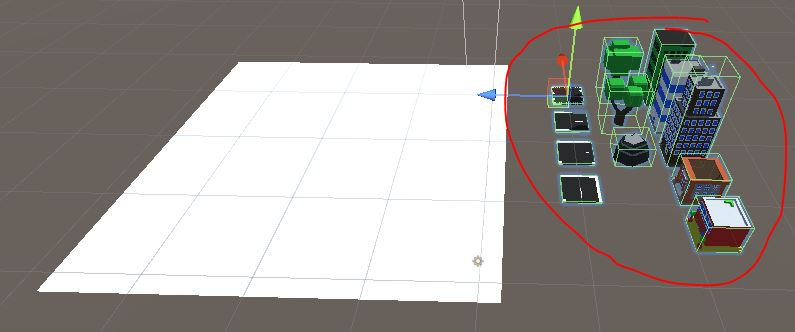

# Empty Scene
Open the "Assets/Scenes/Empty.unity" scene.\
You will see a collection of objects on the right hand side.

Select one of those objects, and you'll see it has the **Prototype** component on it.


# Prototype.cs
```
public class Prototype : MonoBehaviour
    // TODO add IPointerClickHandler
{
    Playfield m_playfield;

    void Start()
    {
        m_playfield = Playfield.Get();
    }

    public GameObject MakeOne()
    {
        GameObject newObj = null;

        {   // TODO Instantiate a copy of this GameObject
            // Remove the Prototype component from the copy (Destroy() the component)
            // Add a Dragable component to the copy
            // Add the copy to the Playfield with Playfield.AddObject()
        }

        return newObj;
    }

    // TODO implement OnPointerClick(PointerEventData eventData)
    // Use Playfield.FindOpenSlot() to see whether there is room to add an object or not
    // If there is room, call MakeOne() to make an object
    // And select the new object with Playfield.SelectObject()
}
```

## MakeOne
In function `MakeOne()` there is a **TODO**

{: .todo}
* `Instantiate()` a copy of this **GameObject**
* Remove the **Prototype** component from the copy (`Destroy()` the component)
* Add a **Dragable** component to the copy
* Add the copy to the **Playfield** with `Playfield.AddObject()`

## On Touch/Click
There's a **TODO** at the top, and another one at the end for this.

{: .todo}
* Inherit from IPointerClickHandler
* Implement OnPointerClick(PointerEventData eventData)
    * Use `Playfield.FindOpenSlot()` to see whether there is room to add an object or not
    * If there is room, call `MakeOne()` to make an object
    * And select the new object with `Playfield.SelectObject()`

{: .test}
You should be able to create objects and move them around the scene.


{: .warn}
With that all working, let's get to the Save/Load part.\
Better commit and push first.

