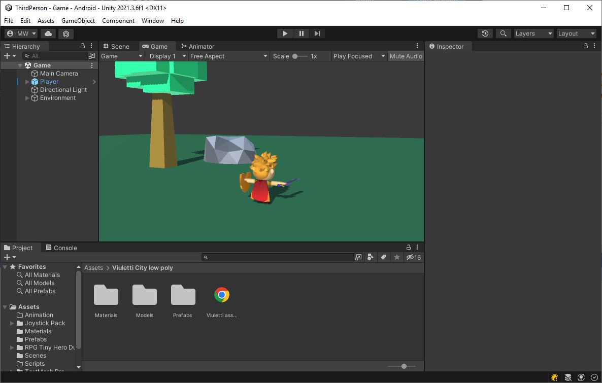

# Accept the Assignment
[Accept the Assignment](https://classroom.github.com/a/6HE5wJ5M)

# Clone the Repo
This is the starting point for the project.\
We will start off with an existing project.

{: .test}
There is only 1 scene in the project "Assets/Scenes/Game.unity".

