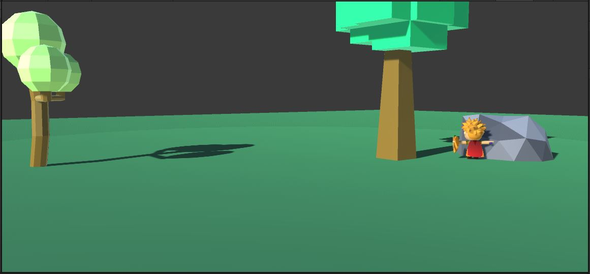

Let's start by making the character simply walk around.

# Character Controller

{: .todo}
* Put a CharacterController (standard Unity CharacterController) on the "Player"
* Adjust the Character's Capsule to more-or-less match the graphics
	* Be sure that the bottom of the capsule is above the ground a little


# Character.cs
## Walking Forward

{: .todo}
* Create a new script called "Character.cs" and attach one to the "Player"
* Give it the following public variables:
```
public float m_walkSpeed = 4.0f;
public float m_turnSpeed = 360.0f;  // degrees per second
```
* In your `Start()`, get the attached **CharacterController** and store that in a member variable
* In `Update()`, let's start by just making the character move forward
* Call `CharacterController.SimpleMove()` to move the player forward at a rate of `m_walkSpeed` units per second
	* `CharacterController.SimpleMove()` automatically includes `Time.deltaTime` so you don't need to

{: .test}
When you Play In Editor, you should see the character moving forward at a steady rate.

## Basic Input
Let's create a structure to abstract the kind of input that our character can take.

{: .note}
There are many different styles of character control.\
Our goal here is to emulate Fortnite.\
In Fortnite, the player always faces in the same direction as the camera, and they can move in any direction (left/right/forward/back)\
However, we want to use the same **Character** base class for NPCs, and they will have freedom to face in any direction.

{: .todo}
* Within the **Character** class, create a public **CharInput** class
* Let's add a Vector3 for the movement direction
	* This is the *input*, so we'll be setting the scale of this input to a range of -1 to 1
	* To make things versatile and easy for NPCs, the movement will be specified in world coordinates
		* move.z means to move in the *world* z-axis regardless of the character or the camera's current angle
	* We won't be using the Y coordinate, but the `Vector3` will make transforms easier
* The player turns to match the camera, and the NPCs ultimately will turn to face any angle
	* Add a float for the facing direction as an angle
* Add an instance of **CharInput** to your **Character** class
* In `Character.Update()`, read in the keyboard and use that to fill in the **CharInput**
	* The facing angle is easy... just match the forward direction from `Camera.main`
	* For the movement vector, read keys W, A, S, & D
		* Use `Input.GetKey()`
	* Keyboard input is *camera-relative*. We need to convert into *world-space*
		* The camera's forward direction in world space is `Camera.main.transform.forward`
		* Similarly, the camera's right direction is `Camera.main.transform.right`
		* You'll want to normalize these in case the camera is tilted at all

## Movement
Now that we have some input, we need to move the character around.

{: .todo}
* In `Character.Update()`, change the `CharacterController.SimpleMove()` to move based on the movement from the **CharInput**
	* The maximum speed for the character is given by `m_walkSpeed`
	* `Time.deltaTime` is already included with `SimpleMove()`
* Also rotate your `transform` to face in the direction given by the facing angle variable in **CharInput**
	* The maximum turn rate is specified as `m_turnSpeed`
	* Don't forget `Time.deltaTime`. It isn't automatic here since you're doing it yourself

{: .test}
You should be able to move your character around now.\
Notice that the trees and rocks have collisions on them, and you can't walk through them.\
There aren't any camera controls yet, but you can use the editor to turn the camera and watch the character turn with it.


{: .warn}
This is a good spot to commit and push before we move on to the camera controls.
