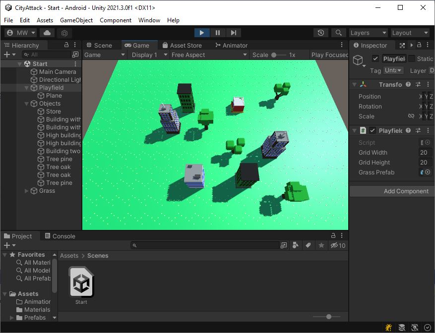

# Accept the Assignment
[Accept the Assignment](https://classroom.github.com/a/jn-QpMzX)

# Clone the Repo
This is the starting point for the project.\
We will start off with an existing project.

{: .test}
Open your starting project in Unity.\
There is 1 scene in there "Assets/Scenes/Start.unity".\

