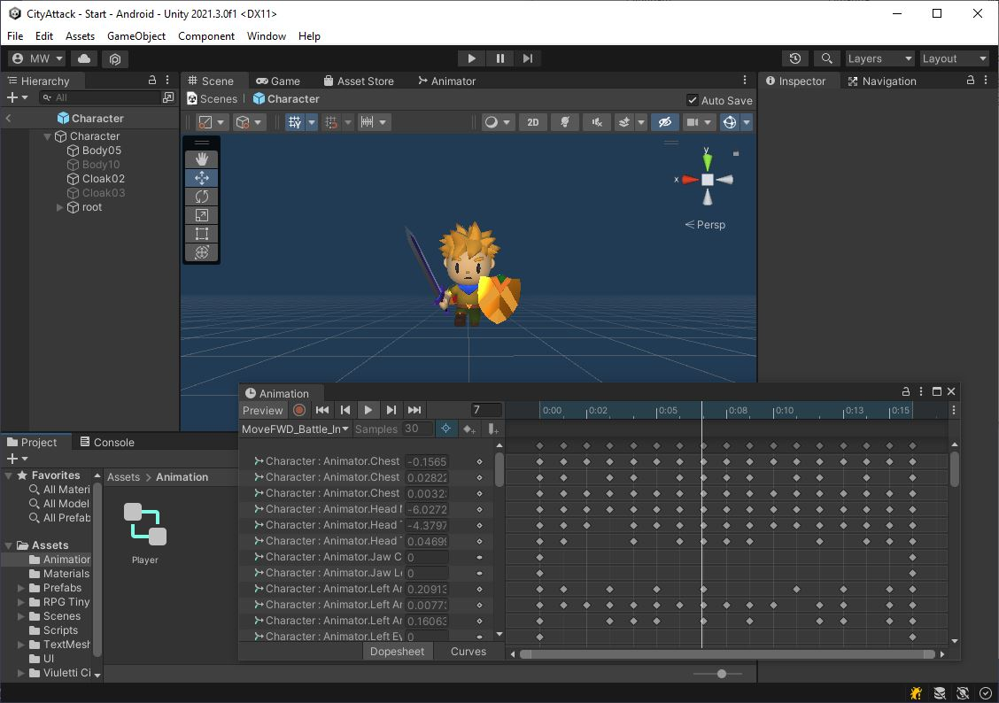

# Animation
There is a "Assets/Prefabs/Character.prefab", but it is bare bones at this point.

{: .todo}
* Bring over the Animator you created for Lab09
* Attach one to the "Character.prefab"

{: .test}
Use the editor to verify that the animations work on the character

# Character.cs
Start by bringing over your **Character** class from Lab09.\
We're going to convert this to AI controls.

{: .todo}
* Copy your "Character.cs" over from Lab09
* Remove the virtual joystick code
	* Leave the keyboard stuff for now. We'll use it to test the character
* Add **Character** to your "Character.prefab"
* Add a unity **CharacterController** to your "Character.prefab"
* Adjust the capsule collider like we did in Lab09
* Drop an instance "Character.prefab" into your scene

{: .test}
When you hit play, you should be able to control your character with the keyboard.\
Use this to verify that the character works

# Pilot.cs
In Lab09, we discussed wanting to make the **Character** class reusable for either the player or an NPC.\
Let's take the controls (which are currently connected to the keyboard), and move those into a separate class.

{: .todo}
* Create a new class called **Pilot**
* Make the `Start()` function `protected virtual`
	* We will want to override this later for the NPCs
* Give it a public virtual function `public virtual Character.CharInput GetInput()`
* Move all the keyboard controls from `Character.Update()` into `Pilot.GetInput()`
	* The **Pilot** class will read the keyboard in `GetInput()`
	* Set the facing angle
	* Set the attack command if needed
* Add a public function `public void Reset()` to your **Pilot** class
	* Use this to reset the attack command
* Add a **Pilot** to "Character.prefab"
* In `Character.Start()` use `GetComponent<>()` to get the **Pilot**
* In `Character.Update()` replace the old keyboard controls with a call to `Pilot.GetInput()`
* At the end of `Character.Update()` make a call to `Pilot.Reset()`

{: .test}
Make sure you can still control your character now that you've moved the controls into the **Pilot** class.

{: .warn}
Let's commit and push this, and then we can start setting up the AI Navigation system.