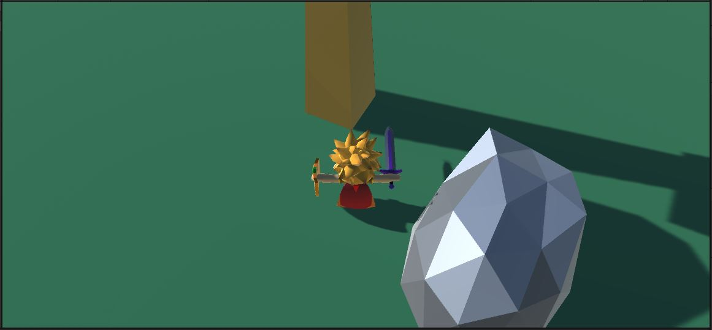

Now that we can move the player, let's have the camera keep up.

# FollowCamera.cs

{: .todo}
* Create a new script "FollowCamera.cs" and attach one to the "MainCamera"
* Give it the following public variables:
```
    public GameObject m_target;
    public Vector3 m_targetOffset;
```
* Point `m_target` at the "Player"
* Set `m_targetOffset` to (0.0, 1.0, 0.0)
    * The origin of the player is at its feet, but we don't want to look at its feet
    * We want to look at a point on the player specified by `m_targetOffset`
    * We have set that to be 1 unit above the player's feet

## Follow the Player
The first step is just to follow the player around as it moves.\
We will be using a simple polar coordinate system to express how the camera should orbit around the player

{: .todo}
* Add the following member variables:
```
    float m_distanceCurrent;
    float m_azimuth;
    float m_elevation;
```
* In `FollowCamera.Start()` calculate the position of the target
    * m_targetOffset transformed from *player-space* into *world-space*
* Based on the starting position of the camera and the position of the target,
    * Calculate the `m_distanceCurrent`
    * Calculate the `m_azimuth`
    * Calculate the `m_elevation`
* In `FollowCamera.LateUpdate()` calculate the position of the target again
    * The player may have moved
* Calculate the new location of the camera
    * Based on `m_distanceCurrent`, `m_azimuth`, `m_elevation`, and the updated target position
* Use `Transform.LookAt()` to look at the updated target position

{: .note}
We need to make sure the player moves before the camera, so we'll update the camera in `LateUpdate()`.

{: .test}
Now if you launch the game, you should be able to walk around, and the camera will move with you.\
There is no camera control yet.

## Camera Input
Like with the **Character** we need some player-input for the camera.\
In this case, there's no need to worry about NPCs wanting to use it.

{: .todo}
* Add the following public variables to your **FollowCamera**:
```
    public float m_panSpeed = 180.0f;   // degrees per second
    public float m_tiltSpeed = 180.0f;  // degrees per second
    public float m_tiltMax = 0.0f;      // degrees
    public float m_tiltMin = -60.0f;    // degrees
```
* Create a class inside **FollowCamera** called **CamInput**
* We want controls for azimuth (left/right) and elevation (up/down)
* Make them both floats, and we can assume they will be in a range of -1 to 1
* Create an instance of your **CamInput** class as a member variable
* In `FollowCamera.Update()`, read the keyboard, and use that to set these inputs
    * Let's use the arrow keys (`KeyCode.LeftArrow`, `KeyCode.RightArrow`, `KeyCode.UpArrow`, and `KeyCode.DownArrow`)

## Camera Movement
Now that we have some input, we need to make the camera move in response.

{: .todo}
* In `FollowCamera.LateUpdate()`, read the **CamInput** data and update the `m_azimuth` and `m_elevation`
    * `m_azimuth`
        * move at a rate of `m_panSpeed` (don't forget `Time.deltaTime`)
        * freely wrap around in a range of -180 to 180 degrees
    * `m_elevation`
        * move at a rate of `m_tiltSpeed` (don't forget `Time.deltaTime`)
        * clamp to a range of `m_tiltMin` to `m_tiltMax`
* Be sure you update these *before* you calculate the new position of the camera as described above

{: .test}
You can now pan and tilt the camera while you run around


{: .warn}
Commit and push before the next step