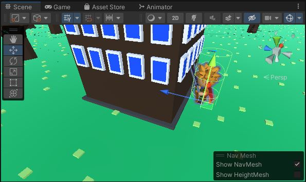

# NPC AI
Like in Clash of Clans, the goal of the NPC is to attack buildings.\
They must first find a building, then walk to it, and finally they can attack the building.

## State Machine
Let's create a very simple finite state machine.

{: .todo}
* Add an enum to **AIPilot** for your states
	* walking to target (start off in this state)
	* attacking target
* You need a building to attack. Buildings have the **Destructable** component on them
	* Add a member variable to **AIPilot** for which **Destructable** to attack next
	* It starts off as null
* If you don't have a target (or the target has died), you'll need to get a new target
	* Create a function for this: `void GetTarget()`
	* Search through all the **Destructable** in the scene
	* Prefer targets with higher `Destrucable.value`
	* Prefer targets that are closer to the NPC's current location
* In your `GetInput()` function, check the state and handle each one
	* I suggest you split off the handling of each state into a separate function for readability

## Walk To Target

{: .todo}
* If you have no target, call your `GetTarget()` function
* If you *still* have no target, just stand still
	* Set your **CharInput** fields to stand still
* If you have a target, set that to be the new destination of your **NavMeshAgent**

{: .test}
Your NPC should walk up to the nearest building.

## Attack Building
If you're close enough to the target, start attacking it.

{: .todo}
* In the *walk-to-target* state, look for buildings close enough to attack
* Add a public variable `m_attackRange = 1.5f`
* Use `Physics.OverlapSphere()` to find targets in range
	* Only accept targets with a **Destructable** on them
* If you find a target, transition to the *attacking* state
* In the *attack* state, set the attack command on the **CharInput**
* If the target is gone or destroyed, transition back to the *walk-to-target* state

{: .test}
Your character should walk to the nearest building and then begin spinning endlessly trying to attack it.

## Attack Timer
Let's set up a minimum time between attacks.

{: .todo}
* In your **Character** class, add a `public float m_attackDelay = 1.0f`
* In `Character.Update()` when you're reading the attack input,
	* Each time you start an attack animation, begin a timer
	* Do not allow another animation to occur unless at least `m_attackDelay` seconds have passed

{: .test}
Now the attack animations should occur no more than once per second.

## Attack Damage
Now let's make the attacks do something.

{: .todo}
* Add some public variables to your **Character**
	* `public float m_attackRange = 2.0f`
	* `public float m_attackDamage = 10.0f`
* Add a public function to perform the attack `public void DoAttack()`
	* Use `Physics.OverlapSphere()` again
	* List all **Destructable**s you hit
	* Call `Destructable.Damage()` on them
* Open the attack animation "Assets/RPG Tiny Hero Duo/Animation/SwordAndShield/Attack04_Spinning_SwordAndShield.fbx"
	* Find the animation clip itself
	* Hit Control+D to *duplicate* the animation clip as a writable copy
	* 
* Change your **Animator** to refer to your new duplicated clip instead of the *read-only* original
* Open the Animation Window and select your new duplicated clip
* Add an event to it
	* Choose a time when the attack is underway
	* Call your `DoAttack()` function
	* 

{: .note}
The `m_attackRange` on **Character** is larger than the `m_attackRange` on **AIPilot**.\
This is to make sure the character does not stand just barely out of range trying to attack a building they cannot hit.

{: .test}
Your character should now run up to the nearest building and start attacking.\
After 10 attacks, the building should vanish.\
Then the character should start running to the next building.

{: .warn}
Commit and Push.

