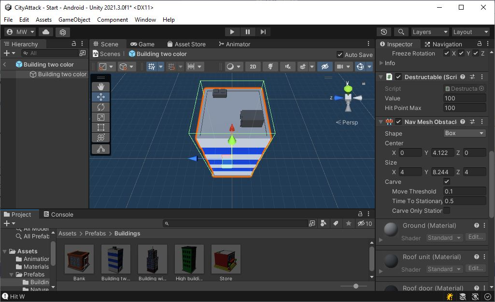
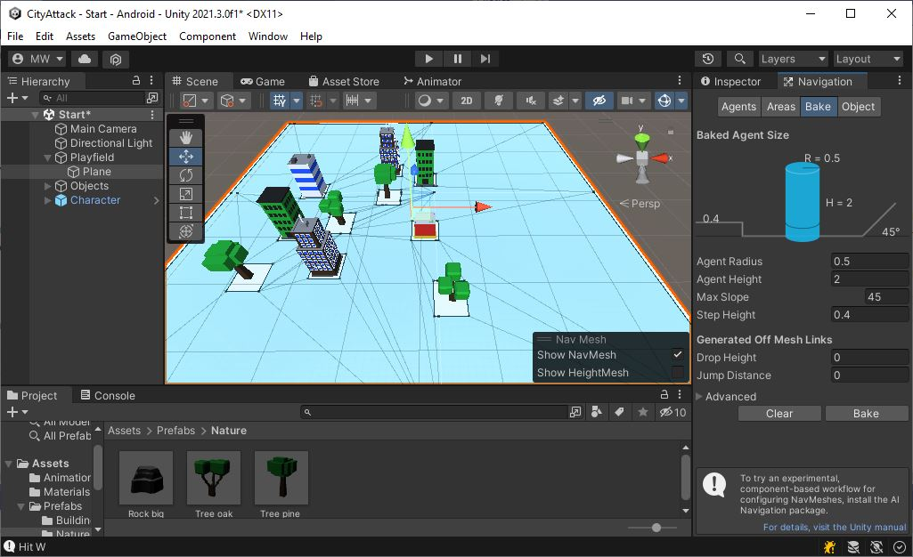
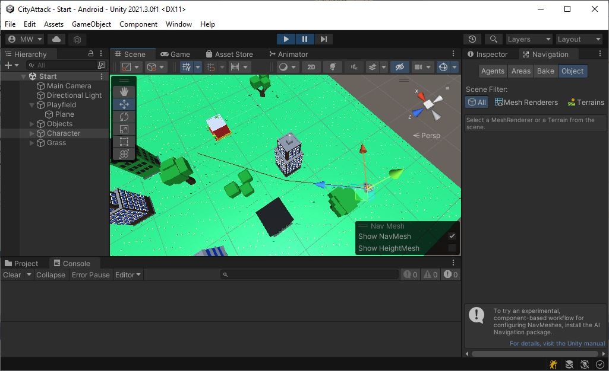

# NavMesh
Let's set up the navigation mesh.

{: .todo}
* Select object "Playfield/Plane"
* Open the Navigation window
* Hit "Bake"

# NavMeshObstacle
Our NPCs need to navigate around the buildings.

{: .todo}
* Add a **NavMeshObstacle** component to each of the buildings and the trees
	* Mark the "Carve" checkbox
	* Un-mark the "Carve Only Stationary" box
	* Don't do the roads. We don't want NPCs to avoid roads

* You may need to re-bake the **NavMesh** on "Playfield/Plane"

{: .test}
It should look like this now:

# NavMeshAgent and AIPilot

{: .todo}
* Add a **NavMeshAgent** component to the "Character.prefab"
* Create a new class called **AIPilot**
* Inherit from **Pilot**
* Override the `Start()` function
	* Get the **NavMeshAgent** and store that in a member variable
	* Set `NavMeshAgent.updatePosition` to false
	* Set `NavMeshAgent.updateRotation` to false
		* Our **Character** class will be doing the movement
	* Copy `Character.m_walkSpeed` into `NavMeshAgent.speed`
	* Call `base.Start()`
* Override the `GetInput()` function
	* Use `NavMeshAgent.desiredVelocity` to set up the movement vector in your **CharInput**
		* Remember that `desiredVelocity` has a scale of 0 to `speed`. You'll need to re-scale this into the 0 to 1 range
	* Make the facing angle of **CharInput** match the direction of movement
	* Return your **CharInput**
	* Do not call `base.GetInput()`. We do not want the keyboard controls.
* Override the `Reset()` function
	* Copy `transform.position` into `NavMeshAgent.nextPosition`
		* The character was moved by `Character.Update()`, and the agent needs to be updated manually
	* Call `base.Reset()`
* Remove the **Pilot** from "Character.prefab" and replace it with an **AIPilot**

{: .test}
To test it out, add a *temporary* line to `AIPilot.Start()`.\
For testing, call `NavMeshAgent.SetDestination(new Vector3(38.0f, 0.0f, 38.0f))`.

{: .warn}
Remove your test code (the `SetDestination()`), commit, and push.\
Let's get on to some AI.

