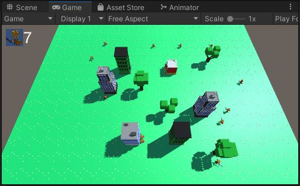

# UI
We only have the 1 kind of troop, but let's put it into the UI.

{: .todo}
* Add a UI image in the top-left corner
	* Use "Assets/UI/Character.png"
* Place a UI text counter next to it
	* Use TextMeshPro

# Playfield.cs
When the user touches the playfield, we want to deploy the selected troops.

{: .todo}
* Remove the character from the scene
    * The one that we've been using to test up until now
* Add the following public variables to **Playfield**
    * `public GameObject m_characterPrefab`
    * `public int m_characterMax = 20`
    * `public float m_spawnDelay = 0.25f`
    * `public TextMeshProUGUI m_spawnCounter`
* Fill in `m_characterPrefab` with "Character.prefab"
* Fill in `m_spawnCounter` with the UI text counter you created above
* In `Playfield.Start()`
    * Change the text of `m_spawnCounter` to indicate how many troops are left
* In `Playfield.Update()`
    * Look for mouse button (finger held down)
    * Convert the screen position of mouse/finger to a position on the ground
    * If that position is on the ground, spawn a troop at that location
    * Reduce the count of remaining troops
        * And update the UI counter
    * When all troops have been deployed, do not allow the player to deploy any more
    * Limit the troops to once every `m_spawnDelay` seconds

{: .test}
You can depoly your troops by dragging your finger around the screen.

{: .warn}
Commit and push before we do the "Choose Your Path"